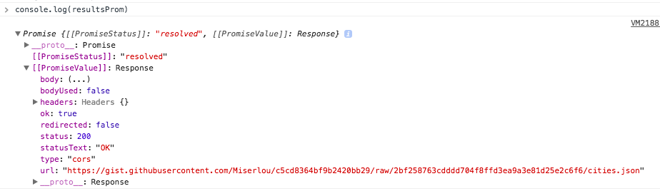
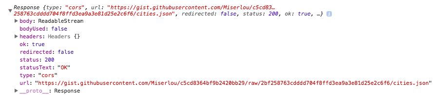

<div class="blog-header-image">
  
</div>


This was another great lesson from Wes Bos's awesome [JavaScript 30 course](http://javascript30.com), which teaches JavaScript fundamental concepts to create cool stuff without using any frameworks or libraries, just vanilla JS.

In this demo, we put together a search form that asks a user to fill in a city or state. When you type in a city or state, a list of results appears below filtered by each letter as you type. Pretty neat. I've always thought this would be a complicated thing to put together, but it was actually more simple that I thought, and I learned a lot here.

Here are the takeaways from this lesson:

1. Fetch API
2. JavaScript Promises
3. The ES6 Array Spread Operator
4. Using JavaScript `RegExp` from a text `input`
5. Listening for different kinds of text input events

Here are links for:

[Codepen](https://codepen.io/whyohengee/pen/bMOpma)

[Github Pages](https://whyohengee.github.io/ajaxtypeahead/)

[Github Repo](https://github.com/whyohengee/ajaxtypeahead/)


## Fetch API and JavaScript Promises
I've used [`jQuery.ajax()`](https://api.jquery.com/jQuery.ajax/) to make AJAX calls because it presents a simple way to both make requests and handle responses, and most of the projects I've worked on already used jQuery so there wasn't additional overhead.

I'd heard of the new [`fetch`](https://developer.mozilla.org/en-US/docs/Web/API/Fetch_API) API, but this was my first chance to use it.

So `fetch` works by returning a [Promise object](https://developer.mozilla.org/en-US/docs/Web/JavaScript/Reference/Global_Objects/Promise). What's a Promise? [Here's a good intro](https://developers.google.com/web/fundamentals/primers/promises).

Promises are exciting because they address JavaScript's single-threaded, synchronous nature. I liked the description the post used: humans are multi-threaded...we can do multiple things at the same time. JavaScript can only execute one thing at a time, and when it hits something that may take a long time (like an API call), then everything else halts until that thing is completed.

A Promise object is supposed to smooth out difficulties with working with asynchronous code...for example, making multiple API requests. Ideally, we'd want something like this:

```js
img1.callThisIfLoadedOrWhenLoaded( function () {
  //loaded
}).orIfFailedCallThis( function () {
  //failed
});

// and...
whenAllTheseHaveLoaded([img1, img2]).callThis( function () {
  //all loaded
}).orIfSomeFailedCallThis( function () {
  //one or more failed
});
```

Promises give us a way to do this. Ok, I'm getting more excited about Promises now.

According to [that post I mentioned earlier](https://developers.google.com/web/fundamentals/primers/promises), here are the terminology basics with Promises:

A Promise can be:

  * **fulfilled**: The action relating to the Promise succeeded
  * **rejected**: The action relating to the Promise falied
  * **pending**: Hasn't fulfilled or rejected yet
  * **settled**: Has fulfilled or rejected

So when you create a Promise, it takes two parameters: `resolve` and `reject`. If eveything worked, you call `resolve`; if it doesn't, you call `reject` with an error message.

If the Promise is fulfilled—ie, success, you can use an important method called [`.then()`](https://developer.mozilla.org/en-US/docs/Web/JavaScript/Reference/Global_Objects/Promise/then) to handle the next step of processing for the Promise. I like the language: "*then* what happens?" Here's an example:

```js
var p1 = new Promise(resolve, reject) => {
  if (/*everything is ok*/) {
    resolve("Success!");
  }
  else {
    reject(Error("It broke"));
  }
}

p1.then( value => {
  console.log(value); //Success
}, reason => {
  console.log(reason); //Error
});
```

Alright, back to how we're using `.fetch()` and Promises in this demo. There're a few things to explain:


### The `fetch()` request
When we call `.fetch()`, what we get back isn't the data—it's a Promise object. So let's say we've stored the results of our `.fetch()` request in a variable:

```js
const endpoint='https://gist.githubusercontent.com/Miserlou/c5cd8364bf9b2420bb29/raw/2bf258763cdddd704f8ffd3ea9a3e81d25e2c6f6/cities.json';

let resultsProm = fetch(endpoint);
console.log(resultsProm);
```

Here's what's logged:



So this is what a Promise looks like. Kinda similar to an XHR, with things like status. We got a Promise back, so let's do something with it using `.then()`.


### What do you do with the Promise?
We're getting a Promise back, the request was successful, which means we can now call `.then()`.

What we're getting back from calling `.then()` is a Response object from the Promise. Why are we calling it a 'blob?' Wes explains that what's coming back from the `fetch` is data whose type/kind isn't known yet. It could be an image, or some html, or whatever. If we take a look at what's returned from calling `.then()`:

```js
fetch(endpoint).then(blob => console.log(blob));
```

Here's what the Response object—ie, `blob`—looks like:



We know what we want back is some JSON, but we don't get that right away. We have to convert the `blob` (ie, the Response) into JSON...what about using [`JSON.parse()`](https://developer.mozilla.org/en-US/docs/Web/JavaScript/Reference/Global_Objects/JSON/parse)? If you open up the prototype for the Response object in the console, there's actually a `json` method there already. So we can do something like this:

```js
fetch(endpoint).then(blob => blob.json());
```

*That* method—`blob.json()`—actually returns *another* Promise!


### Chaining `.then()`s
We can finally convert the raw data we receive from `.fetch()` into the JSON that we want by calling `.then()` on what's returned from `blob`'s `.json()`. Ok, that sounds confusing...here's what's happened so far:

  1. We called `.fetch()` and passed in an endpoint as the argument.
  2. Calling `.fetch()` returned a Promise. We called `.then()` on that Promise, and what was returned was a Response object we're calling `blob`.
  3. `blob` has a `.json()` method. When we call that, we don't get back JSON, we get back another Promise. To be honest, I'm a little confused by why this would be...[here's a SO post](https://stackoverflow.com/questions/37555031/why-does-json-return-a-promise-if-in-an-object-literal) that goes into it. I read it, but I think I need a better example to fully understand this.

Maybe one of the nicest things about Promises and its `.then()` method is being able to chain them to create a series of actions that makes sense when you read it (I think some people call this composition...). How do we finally get to the body of the JSON data in a nice, clean way?

```js
fetch(endpoint)
  .then(blob => blob.json())
  .then(data => console.log(data));
```

## The spread operator
New to ES6 is something called the [spread operator](https://developer.mozilla.org/en-US/docs/Web/JavaScript/Reference/Operators/Spread_operator), whose syntax is just an ellipse: `...`

It can be used with Arrays or object literals. Great video about it [here](https://www.youtube.com/watch?v=j2DMwUYEC88).

For this demo, we're just using the spread operator for Arrays.

So we have the array of data that we get from using `.fetch()`. We're going to be filtering that dataset on whatever is typed in the text input. A couple of things come to mind:

  1. To use `.filter()`, we need an Array (since `.filter()` is an Array method).
  2. The data that we get back from `.fetch()` is JSON, not an array.

So how do we get the data we fetched into an array?

First, declare an array to hold the data:

```js
const cities = [];
```

The usual method of adding elements to an array is by using the `Array.push()` method, which adds whatever you pass into `.push()` to the end of the array. But if we were to do (and I'm just going to write out the whole thing here to show context):

```js
fetch(endpoint)
  .then(blob => blob.json())
  .then(data => cities.push(data));
```

What we'll get is a single element within the `cities` array, and that single element will be an array itself with all of the data. To access stuff from within it, we'd have to do something like `cities[0][0].city`, which is pretty ugly and confusing. Instead, we can use the spread operator like so:

```js
fetch(endpoint)
  .then(blob => blob.json())
  .then(data => cities.push(...data));
```

What this magic gets us is taking the JSON data we got from `.fetch()` and adding it to our `cities` array as individual elements: each object in the JSON dataset will be an index in the array. And that means we can do something like this to access the data: `cities[0].city` or `cities[1].city`.

Much cleaner, much easier to understand.


## Regular expressions using JavaScript's RegExp()
So we've used `.fetch()` to get the main dataset, which includes a complete list of cities/states; and we've converted that data to an Array so we can filter against it. We want to match whatever's typed in the text input against this dataset, so we'll have a function to handle this:

```js
function findMatches(wordToMatch, cities) {
  return cities.filter(place => {
    //Here we need to figure out if the city/state matches what was searched
  })
}
```

We're passing in two arguments:
  * The first arg will be what's coming from the text input.
  * The second arg will be the "master" list of cities, the original dataset in Array form.

Remember how we made sure the dataset was an Array by using the spread operator? That's because we need to use `Array.filter()`, which we're doing within this function.

How do we do the actual matching? JavaScript strings provides at least two methods we might consider using: [`String.includes()`](https://developer.mozilla.org/en-US/docs/Web/JavaScript/Reference/Global_Objects/String/includes) and [`String.match()`](https://developer.mozilla.org/en-US/docs/Web/JavaScript/Reference/Global_Objects/String/match). The `String.includes()` method is case-sensitive, so it won't be a good one to use here.

`String.match()` takes a regular expression object as an argument, and looks to match that regex within a string. If the string has a match for the expression, it returns an array containing the matched string as the first element, followed by any results in parentheses (or `Null` if there were no matches). We're going to use `String.match()`.

We'll need to pass it a regular expression, so we'll create one using [JavaScript's `RegExp` object](https://developer.mozilla.org/en-US/docs/Web/JavaScript/Reference/Global_Objects/RegExp)...again, I'm showing the whole function to see this particular task in context:

```js
function findMatches(wordToMatch, cities) {
  return cities.filter(place => {
    let regex = new RegExp(wordToMatch, 'gi');
    return place.city.match(regex);
  })
}
```

Note that the `RegExp` constructor takes a couple of flags as the second argument:

`g` is the global flag, and it means look for all matches, not just the first match.
`i` means ignore case.

So now, if we call

`findMatches('yo', cities);`

We'll get back a smaller array containing all cities that contain the string 'yo'.

I didn't know about the `RegExp` functionality in JavaScript, and it made this so much simpler than I imagined.

Now we have a function that, when we pass it a string of characters, will search our dataset for matches. You can check it by calling it from the console.

But wait—currently, the function only handles matches on cities. What about states? Do we need a whole new array to hold states to match aginst? Or a whole different function to call to match against the state array?

Nope.

We just need a `||` operator:

```js
function findMatches(wordToMatch, cities) {
  return cities.filter(place => {
    let regex = new RegExp(wordToMatch, 'gi');
    return place.city.match(regex) || place.state.match(regex);
  })
}
```

Ok, now we want to call the `findMatches()` function when something happens with the text input.


## Which event do we listen for from the text input?
There are a few ways to go about this. The first thing we'll need to do is grab the input itself:

```js
const textInput = document.querySelector('.search-form input')
```

Then we can access what's been typed into the input by using `textInput.value`.

There are several events we can listen for. If we were to add event listeners for all of them, it would look like this:

```js
textInput.addEventListener('change', displayMatches);
textInput.addEventListener('keyup', displayMatches);
textInput.addEventListener('input', displayMatches);
```

The `displayMatches()` event handler is where we'll call the `findMatches()` function.

Here are the input events we can use:


### `change` event
This will fire whenever the focus has left the text input, like if you hit the enter or tab keys.

The value taken will be whatever is in the text input after focus has left.


### `keyup` event
This will fire every time a key is entered into the text input (technically, every time a key is pressed down, then the event fires when it's let back up).

The value is everything in the text input every time `keyup` fires.


### `input` event
This one was new to me. [Here's documentation](https://developer.mozilla.org/en-US/docs/Web/Events/input). It fires every time the value of the element is changed. It seems like a newer event (according to [this SO post](https://stackoverflow.com/questions/574941/best-way-to-track-onchange-as-you-type-in-input-type-text), it's HTML5), and [it's got good support](https://caniuse.com/#search=input).

The value is everything in the text input every time `input` fires. I ended up just using this one.


## Displaying the results
The functionality we want is that when the user enters text, matching cities and states will be displayed instantly. So far, we have a way to find the matches, and we have a way to listen for what's happening in the text input. The final step is to display the matches. First, let's grab the element that will display the results:

```js
const resultsList = document.querySelector('.resultsList')
```

Every time the text input changes, we're calling the function `displayMatches()`.

First, we check if there's an empty string in the text input. If there is, we want the display list to show the defaults: "Find a city" and "Find a state". This is what's shown when the page loads, and any time the text input is cleared.

If the text input isn't empty—ie, someone's typed something, then we need to look for matches (doing this via the `findMatches()` function). The `findMatches()` function returns an array: a subset of the orginal dataset, and it contains matches to to what's in the text input.

We can run `.map()` on this returned array to create an `<li>` for each result. Since `.map()` returns an array, we need to chain a `.join()` on it so it returns a long string, which is the chunk of html we'll use to display the results. Here's what that looks like:

```js
function displayMatches() {
  let html;
  //Default:
  if (this.value === "") {
    html = `
      <li>Filter for a city</li>
      <li>Filter for a state</li>
    `;
  }
  else {
    //Return the matches
    const resultsAry = findMatches(this.value, cities);
    html = resultsAry.map(place => {
      return `
        <li>
          <span class="name">${place.city}, ${place.state}</span>
          <span class="population">pop: ${place.population}</span>
        </li>
      `;
      }).join(''); //Use .join() to create a string
    }
  suggestions.innerHTML = html;
}
```

And each time the input changes, we do this again.

One nice formatting thing we can do is


### Highlight the matched characters in the displayed results
The first thing we'll need is a CSS class to show the highlight (I think of this color as "Wes Bos Yellow"):

```css
.hl {
  background: #ffc600;
}
```

To match the text that's typed with what appears in the results, we need to create a variable for a new `RegExp` object to hold what's been typed in the text input. Within this var, we use the `String.match()` function, which will swap out what's in the resulting match with a formatted `<li><span class="hl"></li></span>` to show the highlighted, matched text. Don't forget, we need to do the same thing for states. The string that we return from this will include this swapped-out `<span class="hl">`. Here's the whole function for context:

```js
function displayMatches() {
  let html;
  //Default:
  if (this.value === "") {
    html = `
      <li>Filter for a city</li>
      <li>Filter for a state</li>
    `;
  }
  else {
    //Return the matches
    let resultsAry = findMatches(this.value, cities);
    html = resultsAry.map(place => {
      let matchedString = new RegExp(this.value, 'gi');
      let cityName  = place.city.replace(matchedString, `<span class="hl">${this.value}</span>`);
      let stateName = place.state.replace(matchedString, `<span class="hl">${this.value}</span>`);
      console.log(stateName);
      return `
        <li>
          <span class="name">${cityName}, ${stateName}</span>
          <span class="population">pop: ${place.population}</span>
        </li>
      `;
      }).join(''); //Use .join() to create a string
    }
  suggestions.innerHTML = html;
}
```

When I first ran this, I found a weird result: The matched text was highlighted, but it was all lower-case. To fix this, you just need to add the CSS formatting property, `text-transform`:

```css
.suggestions li {
  /*other stuff*/
  text-transform: capitalize;
}
```

And another nice formatting touch would be to

### Format commas in the population number
For this, I found a function online and copied that:

```js
function numberWithCommas(x) {
  return x.toString().replace(/\B(?=(\d{3})+(?!\d))/g, ',');
}
```

And we can call that within the `displayResults()` function where we add the population:

```js
function displayMatches() {
  let html;
  //Default:
  if (this.value === "") {
    html = `<li>Filter for a city</li>
            <li>Filter for a state</li>`;
  }
  else {
    //Return the matches
    let resultsAry = findMatches(this.value, cities);
    html = resultsAry.map(place => {
      let matchedString = new RegExp(this.value, 'gi');
      let cityName  = place.city.replace(matchedString, `<span class="hl">${this.value}</span>`);
      let stateName = place.state.replace(matchedString, `<span class="hl">${this.value}</span>`);
      console.log(stateName);
      return `
        <li>
          <span class="name">${cityName}, ${stateName}</span>
          <span class="population">pop: ${numberWithCommas(place.population)}</span>
        </li>
      `;
      }).join(''); //Use .join() to create a string
    }
  suggestions.innerHTML = html;
}
```


## Placement of backticks matter
I had a weird issue where I couldn't get the results to display properly. I was returning a [template literal](https://developer.mozilla.org/en-US/docs/Web/JavaScript/Reference/Template_literals) with a chunk of html that looked like this. I put the first backtick on the next line after the `return` statement because I thought it looked cleaner:

```js
return
    `
      <li>
        <span class="name">${place.city}, ${place.state}</span>
        <span class="population">${place.population}</span>
      </li>
    `;
  }).join('');
```

Once I changed it to this, it worked:

```js
return `
      <li>
        <span class="name">${place.city}, ${place.state}</span>
        <span class="population">${place.population}</span>
      </li>
    `;
  }).join('');
```

Took me a few minutes to figure it out. Lesson learned.


## Check if an image has finished downloading with `img.complete`
In the above example for Promises, the example code checks to see if an image has completed downloading by using:

```js
if (img.complete)
```

but I couldn't find any reference to the 'complete' attribute in the documentation for HTML [`img`](https://developer.mozilla.org/en-US/docs/Web/HTML/Element/Img).

I did however find this Stack Overflow thread on it:

[https://stackoverflow.com/questions/12685844/html-img-attribute-complete](https://stackoverflow.com/questions/12685844/html-img-attribute-complete)

The top comment mentioned that it's not part of a spec, but it can be read using the `getAttribute()` method. [This post](https://www.bennadel.com/blog/2493-testing-img-complete-with-no-src-attribute.htm) also mentions checking the `img.complete` property. The post, by Ben Nadel, also mentions that whether or not having a `src` attribute defined for the image does matter depending on browser; it's a post from 2013 though, so I'm not sure where this currently stands.


## Lesson from Wes
There was a point in all this where he said (this was when we had functionality for finding a match based on what was entered in the text input:

<div class="quote">Good, so we've got the data, and that's what I'd like to stress when we're doing this stuff. Get your data first, get all your functionality in place, and then we'll worry about hooking it up to event listeners as well as creating the HTML that we need there.</div>

I get caught up all the time in smaller details. This was a good lesson in prioritizing tasks.


## Resources
<div class="resources">
  <ul>
    <li><a href="https://javascript30.com">JavaScript 30</a></li>
    <li><a href="https://api.jquery.com/jQuery.ajax/">jquery.ajax()</a></li>
    <li><a href="https://developers.google.com/web/fundamentals/primers/promises">JavaScript Promises: An Introduction</a></li>
    <li><a href="https://developer.mozilla.org/en-US/docs/Web/JavaScript/Reference/Global_Objects/Promise/then">JavaScript Promises: .then()</a></li>
    <li><a href="https://www.youtube.com/watch?v=j2DMwUYEC88">YouTube video on spread operators and rest parameters</a></li>
    <li><a href="https://developer.mozilla.org/en-US/docs/Web/JavaScript/Reference/Global_Objects/String/includes">MDN: String.includes</a></li>
    <li><a href="https://developer.mozilla.org/en-US/docs/Web/JavaScript/Reference/Global_Objects/String/match">MDN: String.match</a></li>
    <li><a href="https://developer.mozilla.org/en-US/docs/Web/JavaScript/Reference/Global_Objects/RegExp">MDN: RegExp</a></li>
    <li><a href="https://developer.mozilla.org/en-US/docs/Web/Events/input">MDN: input Event</a></li>
    <li><a href="https://developer.mozilla.org/en-US/docs/Web/JavaScript/Reference/Template_literals">MDN: Template Literals</a></li>
    <li><a href="https://stackoverflow.com/questions/12685844/html-img-attribute-complete">Stack Overflow thread on img.complete</a></li>
  </ul>
</div>