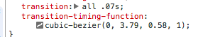

<div class="blog-header-image">
  <video src="https://media.giphy.com/media/xUySTEJYS5F1Cayg92/source.mp4" type="video/mp4" autoplay="true" muted="true" loop="true"></video>
</div>


This fun little exercise was part of [Wes Bos's](https://twitter.com/wesbos) excellent [JavaScript 30 course](https://javascript30.com/), a great way to dive deeper into the fundamentals of JavaScript without getting hung up on frameworks or libraries. Great series!

In this project, we drew a clock using CSS, then used JavaScript to set and update the time and run a second hand with an animation that ticks like a real clock.

You can check out the [Codepen here](https://codepen.io/whyohengee/pen/gzBrde) and the [Github repo here](https://github.com/whyohengee/cssclock).

## Let's start with the markup
The markup is pretty simple. We have a main `<div>` with `class=clock`. This will a wrapper element. In it, we have another `<div>` with `class=clock-face`. This is going to be where we draw the clock face. And within that, we have `<div>`s for each of our hands: the hour hand, the minute hand, and the second hand. Each one of those has a class of `hand`, with shared styles, and they each have a unique class for specific styles.

Here's what all of the markup looks like:

```html
<div class="clock">
  <div class="clock-face">
    <div class="hand second-hand"></div>
    <div class="hand minute-hand"></div>
    <hand class="hand hour-hand"></hand>
  </div>
</div>
```


## Adjusting the clock hands with `transform-origin` and making them move with `transform: rotate` and `transition`
In the markup, all three clock hands—hour, minute, second—are `<divs>` that are stacked up on top of each other. We're going to use the `transform: rotate()` property to make them move, but by default the rotation would happen in the middle of `div.hand` (the default value for the rotation point is at 50% or the middle of the element). We want them to rotate at the *end* of the hand, and from the center of the clock.

To tackle the problem of having the hand rotate from one end and not the middle of the hand, we can use the `transform-origin` property of each hand element. We want to move the rotation point to the end...this means that the point of rotation will move from the middle of the element to the end of the element, making it so it will rotate from the center of the clock face:

```css
.hand {
  transform-origin: 100%;
}
```

So now all the hands will rotate from their end, not from their middle.

Now another issue is that the `<div>`s are being laid out left-to-right: they're all by default pointing to 9:00. We want the starting point to be 12:00. So to change that:

```css
.hand {
  transform: rotate(90deg);
}

```

Now, all of the hands are pointing to 12:00.

We want these hands to move around the center of the clock, so we'll need to use the CSS [`transition` property](https://developer.mozilla.org/en-US/docs/Web/CSS/transition). When we add this property to our `div.hand` elements, we're saying that we want all available transition properties on this element to make a transition in .5 seconds:

```css
.hand {
  transition: all .5s;
}
```

Now with the `transition` property set, when we change the value of what's passed into `rotate()`, we can see the hand rotating.

But it's jumping; not moving smoothly. To make it move smoothly, we can change the timing of the transtion:

```css
.hand {
  transition: all 0.07s
}
```


## That cool ticking motion of the second hand
It's great that the hands are moving smoothly, but we want that unique back-and-forth ticking motion of the second hand you see on a lot of clocks.

To get this, we're going to use a property called `transition-timing-function`, which will be applie to the second hand.

The value of the property will be `cubic-bezier()`, and we'll pass in some values that work. Both Chrome and Firefox dev tools include a [Cubic Bezier visual editor](https://www.youtube.com/watch?v=GW5-R2ewaqA) that lets you play with the values to get the easing just right.

If you inspect `div.second-hand`, and look at the value for `transition-timing-function`...there's a little icon there:




I ended up using these values:

```css
.hand {
  transition-timing-function: cubic-bezier(0, 3.79, 0.58, 1);
}
```

And that gets that cool ticking motion going.


## The JavaScript to feed the clock the time
So we'll need a way to get the current time. Let's write a JavaScript function for that:

```js
function setDate() {}
```

We want this updated every second, so we call the `setDate()` function every second using [`setInterval()`](https://developer.mozilla.org/en-US/docs/Web/API/WindowOrWorkerGlobalScope/setInterval), which allows you to execute a callback at specified increments of time...here's we're calling `setDate` every second:

```js
setInterval(setDate, 1000);
```

The `setInterval()` call will come after the `setDate()` function definition.

Now within `setDate()`, we can create a [`Date` object](https://developer.mozilla.org/en-US/docs/Web/JavaScript/Reference/Global_Objects/Date), and we'll grab the seconds, minutes, and hours from it:

```js
const now =  new Date();
const seconds = now.getSeconds();
const hours = now.getHours();
const minutes = now.getMinutes();
```

So we have current time values to work with. What do we do with them? We get them to power the clock...if we console log `now.getSeconds()` it's going to return something like:

```
57
58
59
00
```

which are the current seconds ticking by. We need to convert those seconds into *degrees* for the clock. The clock will be 360 degrees all the way around; at 45 seconds, that would mean we want the hand pointing at 270 degrees. So, we'll need to do some conversion:

```js
const secondsToDegrees = ((seconds / 60) * 360) + 90;
```

Why are we adding 90 to the conversion? Remember that we rotated the hands 90 degrees, so we need to account for that, which is done here.

Then we want to move the clock hand based on this value...we're going to use JS to set the CSS like so:

```js
secondHand.style.transform = `rotate(${secondsToDegrees}deg)`;
```

Using trusty [template literals](https://developer.mozilla.org/en-US/docs/Web/JavaScript/Reference/Template_literals) again! Love those backticks.

After doing this for the second hand, we'll need to do it for the minute and hour hands too:

```js
const minsToDegrees = ((minutes / 60) * 360) + 90;
  minuteHand.style.transform = `rotate(${minsToDegrees}deg)`;

const hoursToDegrees = ((hours / 12) * 360) + 90;
hourHand.style.transform = `rotate(${hoursToDegrees}deg)`;
```

One adjustment with the hours though:

  * 60 seconds = 360 degrees
  * 60 minutes = 360 degrees
  * **12 hours** = 360 degrees

So the adjustment would be:

```js
const hoursToDegrees = ((hours / 12) * 360) + 90;
```


## Using dev tools to test stuff out
Changing the values directly in dev tools is a lot faster than changing code, then reloading. Some of the values you can change:

* `transform-origin` (see how the clock hand will rotate)
* How much the hands are rotating...you can change the value of what's in `rotate()` to move the hand around.


##Resources
<div class="resources">
  <ul>
    <li><a href="https://javascript30.com/">JavaScript 30</a></li>
    <li><a href="https://developer.mozilla.org/en-US/docs/Web/CSS/CSS_Transforms/Using_CSS_transforms">Using CSS Transforms</a></li>
    <li><a href="https://developer.mozilla.org/en-US/docs/Web/CSS/transition">Using CSS Transitions</a></li>
    <li><a href="https://developer.mozilla.org/en-US/docs/Web/CSS/transition-timing-function">CSS Transition Timing Functions</a></li>
    <li><a href="https://www.youtube.com/watch?v=GW5-R2ewaqA">Firefox Dev Tools Cubic Bezier Editor</a></li>
    <li><a href="https://developer.mozilla.org/en-US/docs/Web/API/WindowOrWorkerGlobalScope/setInterval">Javascript setInterval()</a></li>
    <li><a href="https://developer.mozilla.org/en-US/docs/Web/JavaScript/Reference/Global_Objects/Date">Javascript Date Object</a></li>
    <li><a href="https://developer.mozilla.org/en-US/docs/Web/JavaScript/Reference/Template_literals">Javascript Template Literals</a></li>
  </ul>
</div>