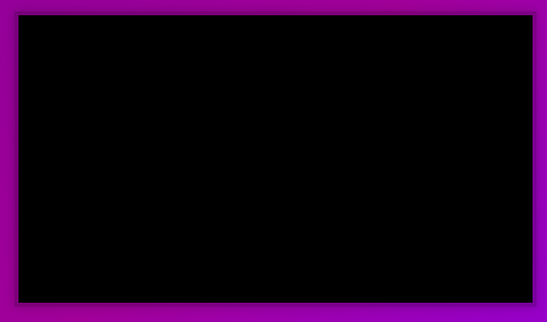
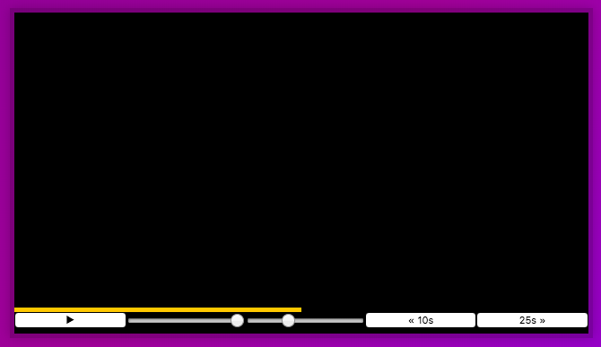
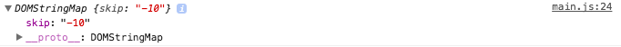

<div class="blog-header-image">
  
</div>


In another demo from the amazing Wes Bos's [JavaScript 30](https://javascript30.com) demo, we're using the [HTML `<video>` element](https://developer.mozilla.org/en-US/docs/Web/HTML/Element/video), but stripping the not-so-great default controls and installing our own, improved UI. Plus adding some features like skip ahead and playback scrubber.

Embedding a video is easy enough, but it'd be great to have a better handle on the viewing experience, especially if you've got multiple videos for your site—you can customize the UI to match your needs.

The controls—like sliders—seem a bit wonky cross-browser. Wes was awesome and provided the default styles, like he does for every exercise. His lesson didn't go into detail about the styles, but in looking at the stylesheet, there's a whole section marked "`unholy css to style input type="range" `". So that got me curious, and I spent some time dissecting those specific styles, which I go into below. This is going to be a loooooong post because I want to break down not just the script, but the styles too.

What I'm learning:

1. Working with HTML5 Video Player
2. Hiding the default controls, and creating custom ones, like skip ahead and playback speed control
3. Specifics of styling the video elements and `input` controls in Webkit browsers


Check out:

[Codepen](https://codepen.io/whyohengee/pen/RyEeMr?editors=0010)

[Github Pages](https://whyohengee.github.io/customvideoplayer/)

[Github Repo](https://github.com/whyohengee/customvideoplayer)


## Basic setup
The `<video>` element only needs a couple of attributes, a `src` and a class to style it. We'll have a main `<div>` to hold the `<video>`, along with another `<div>` that will hold the controls. The controls will be a collection of buttons, inputs, and whatever else we want to include.

Here's the complete markup:

```html
<div class="player">
    <video class="player__video viewer" src="https://player.vimeo.com/external/194837908.sd.mp4?s=c350076905b78c67f74d7ee39fdb4fef01d12420&profile_id=164"></video>

    <div class="player__controls">
     <div class="progress">
      <div class="progress__filled"></div>
     </div>
     <button class="player__button toggle" title="Toggle Play">►</button>
     <input type="range" name="volume" class="player__slider" min="0" max="1" step="0.05" value="1">
     <input type="range" name="playbackRate" class="player__slider" min="0.5" max="2" step="0.1" value="1">
     <button data-skip="-10" class="player__button">« 10s</button>
     <button data-skip="25" class="player__button">25s »</button>
    </div>

  </div>
```

### Styling the body
Ok, basics in place. Now let's start with the `body`:

```css
body {
  margin: 0;
  padding: 0;
  background: linear-gradient(135deg, #7c1599 0%,#921099 48%,#7e4ae8 100%);
  background-size: cover;
  display: flex;
  min-height: 100vh;
  align-items: center;
  justify-content: center;
}
```

Notice how the `margin` and `padding` are both set to 0? That's because the user agent stylesheet will often have default margin for the body. Mine did. So it was good to get that set up. I think I'll do this as part of my reset from now.

Ok, next, there's a `linear-gradient` set. The first arg, `135deg`, sets the direction. Then the next 3 values set the "stops" in the gradient—what color it should be at those points, which are 0%, 48%, and 100%.

Then there's the [`background-size`](https://developer.mozilla.org/en-US/docs/Web/CSS/background-size) property. I usually use these for background images for `<div>`s, and I'm embarrassed at how often I get the two values `cover` and `contain` mixed up. They both scale the image as big as possible without stretching the image, but here's one big difference:

* `contain` does not crop the image
* `cover` does crop the image

Since we're only working with a gradient color as background, it doesn't really matter in this case. But just another reminder.

Next, let's look at the positioning we're setting up. We're setting the body up to be a `flex` container, with the height being the full height of the viewport. We're also saying we want the child container(s) to be centered both vertically and horizonatally...here are the rules that create all of that stuff:

```css
display: flex;
  min-height: 100vh;
  align-items: center;
  justify-content: center;
```


### Styling the main container, `div.player`
We have one main wrapper within the body, `div.player`, which holds two child elements: the `<video>`, and the container for the controls, `div.player__controls` (thumbs up on the [BEM naming conventions](https://css-tricks.com/bem-101/)).

So `div.player` has the following styles:

```css
.player {
  max-width: 750px;
  border: 5px solid rgba(0, 0, 0, .2);
  box-shadow: 0 0 20px rgba(0, 0, 0, .2);
  position: relative;
  font-size: 0;
  overflow: hidden;
}
```

So the `border` puts a nice little transparent bevel around the player, and the `box-shadow` give it a lifted effect. Cool.

We also set relative positioning so we can position the child elements. I'm not sure why the `font-size` is set to 0...
Hiding the `overflow` will let us do the effect where if you hover over the player, the controls will slide up into view; by default, they're hidden away.

Now there are some fullscreen styles we can apply to the parent `div.player` element. I didn't know that there was a [`:fullscreen` psuedo-class](https://developer.mozilla.org/en-US/docs/Web/CSS/:fullscreen), but there is. According to the docs, it represents an element when it is in fullscreen mode. Huh. Here's the CSS:

```css
.player:fullscreen {
  max-width: none;
  width: 100%;
}

.player:-webkit-full-screen {
  max-width: none;
  width: 100%;
}
```

It seems strange that we'd have to set these values—eliminating the `max-width` and explicitly setting the `width` to be 100%—but there you go. I guess I thought if the element goes full screen, these rules would be in place anyway. There's also a rule with a `-webkit-` prefix, though when I ran this, the behavior seemed the same on both Chrome and Firefox.


### Styling the parent container for the custom controls, `div.player__controls`
Ok, let's go into the parent container for the custom controls, `div.player__controls`:

```css
.player__controls {
  width: 100%;
}
```
The controls container will span the full width of its parent, `div.player`.


```css
.player__controls {
  width: 100%;
  display: flex;
  flex-wrap: wrap;
}
```
We're setting up this container element to be a flex container, and overriding the default value of `flex-wrap` from `nowrap` to `wrap`, meaning that child elements will get bumped to the next row if there's not enough space.


```css
.player__controls {
  width: 100%;
  display: flex;
  flex-wrap: wrap;
  position: absolute;
  bottom: 0;
}
```
By setting the `position` to be `absolute` and positioning it at the bottom, we're anchoring this element to a certain position and taking it out of normal flow.


```css
.player__controls {
  width: 100%;
  display: flex;
  flex-wrap: wrap;
  position: absolute;
  bottom: 0;
  transform: translateY(100%) translateY(-5px);
  transition: all .3s;
}
```

This one had me confused. There are two values for the `transform` property; the first one moves it *all* the way out of view (`translateY(100%)`), and the second brings it back up *juuuust* a little bit...5px worth. I tried doing this with just a single value for each, and this is what it looked like.

This is for `transform: translateY(100%)`:



And this is for `transform: translateY(-5px)`:



I thought that the second value would overwrite the first value, but the browser interpreted both, in order.


```css
.player__controls {
  display: flex;
  flex-wrap: wrap;
  width: 100%;
  position: absolute;
  bottom: 0;
  transform: translateY(100%) translateY(-5px);
  transition: all .3s;
}
```
If we're using the `transition` property, we're setting up a starting and end state. Here is the starting state, contained in this class, and we're saying to transition *all* of the properties. We can define an ending state in another class...


```css
.player:hover .player__controls {
  transform: translateY(0);
}
```
The only thing we're transitioning really is the vertical placement...this class says that when we hover over the parent `div.player` element, we bring the `div.player__controls` all the way up (`translateY(0)`).


```css
.player__controls {
  display: flex;
  flex-wrap: wrap;
  width: 100%;
  position: absolute;
  bottom: 0;
  transform: translateY(100%) translateY(-5px);
  transition: all .3s;
  background: rgba(0, 0, 0, .1);
}
```
Finally, we just set a little bit of background color on the controls.


### Styling the progress bar, `div.progress` and its child element `div.progress__filled`
```css
.progress {
  flex-basis: 100%;
}
```
Remember that `div.progress` is a direct child of `div.player__controls`, a flex container. Here, we set the child to take up 100% of the available space, pushing everything else to the next row (remember that we set `flex-flow` to `wrap` on the parent container).


```css
.progress {
  flex-basis: 100%;
  position: relative;
}
```
Setting the `position` value here means that child element—like `div.progress__filled`—positions can be set using placement properties like `top` or `left`.


```css
.progress {
  flex-basis: 100%;
  position: relative;
  display: flex;
}
```
The progress bar isn't just a flex child element, but with this line, we set it up to be a flex container as well, allowing for flexbox to be used on `div.progress__filled`.


```css
.progress {
  flex-basis: 100%;
  position: relative;
  display: flex;
  height: 5px;
  transition: height .3s;
}
```
If we're using the `transition` property, that means there's going to be a starting and ending state. The starting state in this case is the `height`; we'll transition it in a span of .3 seconds with another class where we'll define an ending state.


```css
.player:hover .progress {
  height:15px;
}
```
This is that ending state; we're saying when you hover over the main container, `div.player`, the `div.progress` element will change its height to 15px from whatever its starting state is.


```css
.progress {
  flex-basis: 100%;
  position: relative;
  display: flex;
  height: 5px;
  transition: height .3s;
  background: rgba(0, 0, 0, .5);
  cursor: ew-resize;
}
```
This is simply setting a background color for the progress bar, and making the [cursor](https://developer.mozilla.org/en-US/docs/Web/CSS/cursor) look like a double-arrow when you hover over it.


So let's move on the the child element, `div.progress__filled`:

```css
.progress__filled {
  width: 50%;
  background: #ffc600;
}
```
Two things: set the default width of this to half of the parent container, and make it a nice bright yellow so we can see it.


```css
.progress__filled {
  width:50%;
  background:#ffc600;
  flex: 0;
  flex-basis: 50%;
}
```
The `flex` property is shorthand, and the first value is the `flex-grow` property. [When the value is set to 0](https://stackoverflow.com/a/28474863), it means that the item won't be resized during calculation to accomodate the flex container's full main axis. [The spec for flex-grow](https://www.w3.org/TR/css-flexbox-1/#propdef-flex-grow) states that this number indicates how the element will grow relative to the rest of the flex items; by setting to 0, we're saying it won't grow relative to the other items.

This `flex-basis` property sets the default space it takes before calculation at 50%...I think these 2 rules together say that we're going to set it at 50% to start off with, but if the container grows/shrinks, don't change it.


Now let's get into the buttons and inputs. There are:

* 3 buttons. All three have class `.player__button`, and the first, the toggle play button, also has the class `.toggle`. The other 2 have differing `data-skip` attributes.
* 2 inputs, range sliders. They both have class `.player__slider`. They also have different values for their `name` attributes, and different values for their `min`, `max`, and `step` values, which determine the scales for the sliders.


## Styling the buttons
Let's start with the class all 3 buttons share:

```css
.player__button {
  max-width: 50%;
  line-height: 1;
  background: none;
  color: white;
  padding: 0;
  border: 0;
  outline: 0;
  text-align: center;
  cursor: pointer;
}
```
None of these are too confusing. The `max-width` is setting a sort of outer limit to the width of the buttons, which share space with the range sliders. We align the text symbols to center, and remove background color and make the visible characters white. We also remove the default outline, border, which would also show white otherwise. Padding is removed, and a custom cursor when you hover.


```css
.player__button:focus {
  border-color: #ffc600;
}
```
If you were to tab through the controls, this puts an indicator around the button if it's in focus.


So the range sliders...this is the stuff that Wes called "unholy."


### "Unholy" CSS...styling the input range sliders
We've got 2 sliders that are `input[type='range']`. Here's what they look like without any styles applied:


```css
input[type="range"] {
  -webkit-appearance: none;
}
```
According to the [documentation for the `-webkit-appearance` or `-moz-appearance` prefix](https://developer.mozilla.org/en-US/docs/Web/CSS/-moz-appearance), this will "display an element using platform-native styling based on the operating system's theme." Ok. After applying that style, nothing changed.


```css
input[type="range"] {
  -webkit-appearance: none;
  background: transparent;
}
```


## Thinking about functionality in JavaScript
It might be helpful to break it down into these steps:

1. Get our elements
2. Build our functions
3. Hook up our event listeners


## Functionality: Toggling the 'Play' button
So we have a button that when you hit it, the video will play or pause. I want to get into some clarifications first.

When we're talking about the [HTML `<video>` tag](https://developer.mozilla.org/en-US/docs/Web/HTML/Element/video), we're talking about the HTML element that we use in our markup to embed a video. It will have attributes like `src`, `autoplay`, `width`, and `height`. We're not really using any of these attributes to control the video, though.

To do that, we're using a [DOM Interface called `HTMLVideoElement`](https://developer.mozilla.org/en-US/docs/Web/API/HTMLVideoElement), which has special properties and methods for manipulating video objects. `HTMLVideoElement` inherits from [`HTMLMediaElement`](https://developer.mozilla.org/en-US/docs/Web/API/HTMLMediaElement), which has properties and methods to support audio and video.

So let's grab the `<video>` player:
```js
const player = document.querySelector('.player');
const video = player.querySelector('.video');
```


We need a function that will toggle play/pause:
```js
function togglePlay(e) {
  if (video.paused) {
    video.play();
  }
  else {
    video.pause();
  }
}
```
So `viewer` has an attribute—`paused`—which is [part of HTMLMediaElement](https://developer.mozilla.org/en-US/docs/Web/API/HTMLMediaElement/paused)...it's a Boolean. Without having hooked the function up to any event yet, you can test this by calling the function from the console. This should play/pause the video.


Now we want it so this function is called both when you click the video and the play button. We have a selector for the video, let's grab the toggle play button:

```js
const playButton = player.querySelector('.player__button.toggle');
```

Then we can listen on both of these elements:
```js
video.addEventListener('click', togglePlay);
playButton.addEventListener('click', togglePlay);
```


Ok, great. *But*...when the video is paused, the play button still shows the "play" icon, not the pause icon. How do we change it? Here's a scenario I hadn't thought of: there could be multiple reasons why the video is paused that doesn't include when the video or play button are clicked; for example, a popup appears and pauses the video. Because of these other possibilities, it wouldn't be a good idea to put the code for changing the icon in our `togglePlay()` function. So we'll need *another* function, one that will listen for if the video has been paused.

Although the video player has an attribute called `paused`, there are two events we can listen for, `play` and `pause`:

```js
video.addEventListener('play', toggleIcon);
video.addEventListener('pause', toggleIcon);
```
And in the `toggleIcon` function:

```js
function toggleIcon(){
  const icon = this.paused ? '►' : '❚ ❚';
  playButton.innerText = icon;
}
```
Here, we can use `this` because we're adding the event listener directly to the element `video`. Within the function, we're actually using the attribute `paused`...if the video is paused, we want the play icon; if it's playing, we want the pause icon.


## Functionality: The skip buttons
We've got 2 skip buttons: skip back, and skip ahead. Grab 'em:

```js
const skipButtons = player.querySelectorAll('[data-skip]');
```
We're querying on the `data-` attributes here. Though both skip buttons have this attribute, they have different values...one is `data-skip = -10`, and the other is `data-skip = 25`.

Here's the function signature for the handler:

```js
function skip() {
  console.log(this.dataset);
}
```

What's cool about logging `this.dataset` is that we can see the value of the `data-` attributes:



And we can hook up the event listeners:
```js
skipButtons.forEach(skipButton => skipButton.addEventListener('click', skip));
```
Notice too that when we assign event listeners, we do it using
```js
skipButton => skipButton.addEventListener('click', skip)
```
rather than
```js
skipButton => addEventListener('click', skip)
```
The first one allows us to use `this` in reference to the element in the event handler; the second makes us use `event.target` instead of `this`.


In the handler, we're going to be using the [`currentTime` attribute](https://developer.mozilla.org/en-US/docs/Web/API/HTMLMediaElement/currentTime) to set where the video should play from:

```js
function skip() {
  console.log(this.dataset);
  video.currentTime += parseFloat(this.dataset.skip);
}
```

Note that the value `this.dataset` is a string, so we have to cast it as a number using [`parseFloat()`](https://developer.mozilla.org/en-US/docs/Web/JavaScript/Reference/Global_Objects/parseFloat).

Now, when you click the skip back or skip ahead buttons, the video will skip according to whatever's in that button's `data-skip` attribute.


##Functionality: Range sliders for volume and playback rate
We have the two input sliders, so let's grab them:

```js
const sliders = player.querySelector('[type=range]');
```


We'll have a function to listen for when these sliders are moved:

```js
function handleSliderUpdate(){
  console.log(this.value);
}
```
We'll console log the value of the slider after it's been moved.

And now to listen for when the slider is moved...with the buttons, we were listening for a `click` event. With range sliders, we're listening for a `change` event:

```js
sliders.forEach(slider => slider.addEventListener('change', handleSliderUpdate))
```


Now in the `<input>` tags for boths sliders, we're using a `name` property. One is `name = volume`, the other is `name = playbackRate`. These values are also the names of properties for the video. [Here's the `volume` property](https://developer.mozilla.org/en-US/docs/Web/API/HTMLMediaElement/volume) and [here's the `playbackRate` property](https://developer.mozilla.org/en-US/docs/Web/API/HTMLMediaElement/playbackRate).

Because of that, we can refer to the `this.name` value to access the properties we want to change:

```js
function handleSliderUpdate(){
  video[this.name] = this.value;
}
```


##Functionality: Progress bar
So here's how we want the progress bar to work:

* When you play the video, the progress bar should be updating in real time.
* When you click on it and drag, the video should correspond to that place in the progress bar.

The progress bar is made up of two elements: `div.progress` (the container) and `div.progress__filled`, which is the yellow part of the progress bar. On this element, we're going to be changing the `flex-basis` property to change how much yellow is in the bar. By default, it's set to 50%. You can inspect it and change the values in dev tools to see how it will look at different percentages.

We'll need to grab the progress bar:

```js
const progressFilled = player.querySelector('.progress__filled')
```


So let's start with a function:

```js
function handleProgress() {
  //handling progress
}
```
In it, we need a percentage value to work with `div.progress__filled`'s `flex-basis` value. If 0% is the very beginning of the video, and 100% is the end of the video, we just need to know how long the video is and calculate where it is right now.

We'll need to know 2 different things to figure this out

1. How long is the video?
2. Where are we in the video right now?

These things we need to know correspond to 2 attributes of the HTMLMediaElement, [`duration`](https://developer.mozilla.org/en-US/docs/Web/API/HTMLMediaElement/duration), which is the length of the video, and [`currentTime`](https://developer.mozilla.org/en-US/docs/Web/API/HTMLMediaElement/currentTime), which is the current playback time.

Within our handler, we can figure out the percentage:
```js
function handleProgress() {
  const progress = (video.currentTime / video.duration) * 100; //gives us what percentage to set flex-basis
}
```

Then we can set the `flex-basis` property of the progress bar:
```js
function handleProgress() {
  const progress = (video.currentTime / video.duration) * 100; //gives us what percentage to set flex-basis
  progressFilled.style.flexBasis = `${progress}%`;
}
```


Great, but when do we run this function?
There is an event on `HTMLMediaElement` called [`timeupdate`](https://developer.mozilla.org/en-US/docs/Web/Events/timeupdate) that fires whenever `currentTime` changes. This is what we want: we want the progress bar to reflect how much of the video has played, and we want to be able to go to specific points in the video. So let's set up an event listener:
```js
video.addEventListener('timeupdate', handleProgress);
```
So now when the video starts, the amount of yellow corresponds to how much of the video has been played. Great!


Now, we want to be able to scrub through the progress bar...basically wherever we click on the progress bar, the video should jump to that point. So let's start off with a function:
```js
function scrub() {
  //scrubbing playback
}
```
So whenever someone clicks on the progress bar, we want the video to go to that point. So we'll need to listen for a `click` event on the progress bar. Remember, there's the progress bar (`div.progress`) and the yellow, filled part (`div.progress__filled`). The user will be clicking anywhere on the progress bar, not necessarily just on the yellow part, so we need to grab:
```js
const progress = player.querySelector('.progress');
```

And within the `scrub` function, let's see what we get in the event:
```js
function scrub(e) {
  console.log(e);
}
```
We'll need to hook up the event listener on the progress bar:
```js
progress.addEventListener('click', scrub);
```
So when the progress bar is clicked, we can take a look at what properties are returned. Play around and click in different places, you'll see which property we're looking for...it's `offsetX`, which is the `x` position in pixels relative to the progress bar. (Wes mentioned in the video that that's because the `position` for the progress bar is set to `relative`, but I'm not sure...I commented out this property, and it seemed to return the same value, so I'm not sure).

Since we know that the event will show which position on the progress bar was clicked—`offsetX`—it's handy to know that there is a property all elements have called `offsetWidth`. According to the [docs](https://developer.mozilla.org/en-US/docs/Web/API/HTMLElement/offsetWidth), it returns the *layout* width of the element. Neat! So we can calculate a percentage of where in the video we're trying to get to based on where in the progress bar was clicked:
```js
function scrub(e) {
  let scrubPercent = (e.offsetX / progress.style.offsetWidth);
}
```
And if we multiply that percentage by the total length of the video, we'll get *where* in the video, percentage-wise, we should go:
```js
function scrub(e) {
  let scrubPercent = (e.offsetX / progress.offsetWidth) * video.duration;
}
```
And finally, just setting the video's `currentTime` property, which defines where the playback place should be, to the value we just figured out:
```js
function scrub(e) {
  let scrubPercent = (e.offsetX / progress.offsetWidth) * video.duration;
  video.currentTime = scrubPercent;
}
```


Bingo.

Ok, how about *dragging* the progress bar to where you want to play? Remember how in the [canvas demo](/drawing-on-canvas/) we had a flag to determine if the cursor was down, indicating that the pen is down? We're going to do the same thing. If someone has clicked down on the progress bar, then dragged it somewhere, then clicked up, we want the progress to be at the point where they clicked up.


Ok, baby steps. Let's first set it up so that the progress bar will move on a `mousemove` event, meaning you don't have to click down to move the progress bar:
```js
progress.addEventListener('mousemove', scrub);
```
So what happens with this is that whenever the mouse moves over the progress bar, the video is going to jump to that point. If you move the mouse really fast, the video's going to choke a bit because it has to catch up. Not ideal. So we want to set up the mouse up/down functionality.

We'll need a flag:
```js
let mousedown = false;
```
It's intially set to false because well, the mouse isn't down by default.

Now, some event listener chicanery:
```js
progress.addEventListener('mousemove', scrub);
progress.addEventListener(`mousedown`, () => mousedown = true)
progress.addEventListener('mouseup', () => mousedown = false)
```
I've included the line to listen for `mousemove` on the progress bar just for context. But what's happening in the callback functions for these events:

* If the mouse is clicked down while on the progress bar, flip the flag to `true`.
* If the mouse is clicked up while on the progress bar, flip the flag back to `false`.

By the way, I initially had semicolons at the end of the expressions in the `mousedown` and `mouseup` callbacks, so:
```js
progress.addEventListener(`mousedown`, () => mousedown = true;)
progress.addEventListener('mouseup', () => mousedown = false;)
```
And I was getting an `Uncaught SyntaxError: missing ) after argument list` message. After deleting the semicolons, the errors went away. I'm still getting the hang of the arrow functions as callbacks I guess.


Now, in the line where we listen for the `mousemove` event on the progress bar, we do this:
```js
progress.addEventListener('mousemove', () => {
  if (mousedown) {
    scrub();
  }
});
```
What this says if if the mouse is being moved and flag is true—ie, the mouse is down—then we call our `scrub()` function. The syntax can be cleaned up to be this:
```js
progress.addEventListener('mousemove', (e) => {mousedown && scrub(e)});
```
Here, we're using the [logical `&&` operator](https://developer.mozilla.org/en-US/docs/Web/JavaScript/Reference/Operators/Logical_Operators) to check for two conditions...this says that `scrub()` will only be called if both conditions are true—the flag has to be true. And because the `scrub()` function is taking in the event as an argument, we pass it within the callback.


##Functionality: Fullscreen mode
This one's pretty easy. First, let's add a fullscreen button to our markup:
```html
<button class="player__button fullscreen">FS</button>
```
I had a hard time finding a fullscreen icon, and I didn't want to use a library like Font Awesome just for this demo, so for the purpose of just showing functionality, the button text reads 'FS'. Fine for now. In our script, we'll need to grab this element:
```js
const fullScreenButton = player.querySelector('.fullscreen')
```


We'll have a function to handle a click event on this button:
```js
function toggleFullScreen() {
  //do some fullscreen toggling
}
```


And we'll set up an event listener:
```js
fullScreenButton.addEventListener('click', toggleFullScreen);
```


So there's a [Fullscreen API](https://developer.mozilla.org/en-US/docs/Web/API/Fullscreen_API) for media elements to go fullscreen. It doesn't have *full* [support](https://caniuse.com/#search=full%20screen%20api) yet, but we can use it for this demo. The method we want is called [`requestFullscreen()`](https://developer.mozilla.org/en-US/docs/Web/API/Element/requestFullScreen), and unfortunately we need a vendor prefix in our JavaScript for it. That means we need to first know which vendor we're using.

To do that, we'll use something called `window.navigator.userAgent`, which [returns a string containing info about the type of browser you're using](https://developer.mozilla.org/en-US/docs/Web/API/NavigatorID/userAgent):
```js
const ua = window.navigator.userAgent;
```


Now, within the `toggleFullScreen()` event listener, we can detect which browser we're looking for:
```js
function toggleFullScreen() {
  if (ua.includes('Chrome') || ua.includes('Safari')) {
    console.log('webkit')
  };
  if (ua.includes('Firefox')) {
    console.log('firefox')
  }
}
```
And depending on which browser (not looking at you in this demo, Explorer/Edge), we can use the appropriate method: either `webkitRequestFullScreen()` or `mozRequestFullScreen()`:
```js
function toggleFullScreen() {
  if (ua.includes('Chrome') || ua.includes('Safari')) {
    video.webkitRequestFullScreen();
  };
  if (ua.includes('Firefox')) {
    video.mozRequestFullScreen();
  }
}
```
Note that the method name uses a capital "S", while the default API method uses a lowercase "s".


## Resources
<div class="resources">
  <ul>
    <li><a href="https://javascript30.com">JavaScript 30</a></li>
    <li><a href="https://developer.mozilla.org/en-US/docs/Web/HTML/Element/video">MDN: HTML &lt;video&gt; Element</a></li>
    <li><a href="https://developer.mozilla.org/en-US/docs/Web/CSS/background-size">MDN: CSS backgroud-size</a></li>
    <li><a href="https://css-tricks.com/bem-101/">CSS-Tricks: BEM 101</a></li>
    <li><a href="https://developer.mozilla.org/en-US/docs/Web/CSS/:fullscreen">MDN: CSS Fullscreen</a></li>
    <li><a href="https://developer.mozilla.org/en-US/docs/Web/CSS/cursor">MDN: CSS Styling the Cursor</a></li>
    <li><a href="https://www.w3.org/TR/css-flexbox-1/#propdef-flex-grow">Specification for flex-grow</a></li>
    <li><a href="https://developer.mozilla.org/en-US/docs/Web/API/HTMLVideoElement">MDN: HTMLVideoElement</a></li>
    <li><a href="https://developer.mozilla.org/en-US/docs/Web/API/HTMLMediaElement/volume">MDN: HTMLVideoElement volume property</a></li>
    <li><a href="https://developer.mozilla.org/en-US/docs/Web/API/HTMLMediaElement/playbackRate">MDN: HTMLVideoElement playbackRate property</a></li>
    <li><a href="https://developer.mozilla.org/en-US/docs/Web/API/HTMLElement/offsetWidth">MDN: HTMLElement.offsetWidth</a></li>
    <li><a href="https://developer.mozilla.org/en-US/docs/Web/JavaScript/Reference/Operators/Logical_Operators">MDN: Logical Operators</a></li>
    <li><a href="https://developer.mozilla.org/en-US/docs/Web/API/Fullscreen_API">MDN: Fullscreen API</a></li>
    <li><a href="https://developer.mozilla.org/en-US/docs/Web/API/NavigatorID/userAgent">MDN: NavigatorID.userAgent</a></li>
  </ul>
</div>