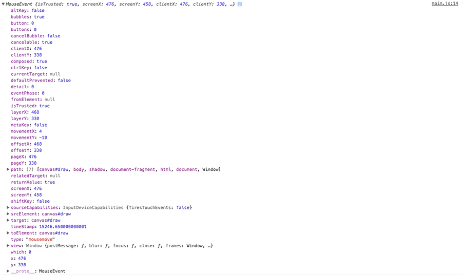
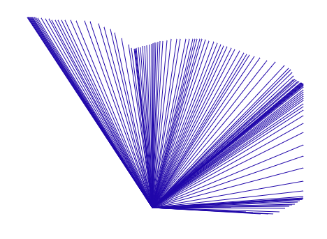

<div class="blog-header-image">
  
</div>

This was a great exercise that showed me a lot about painting onto the screen using [HTML5 Canvas](https://developer.mozilla.org/en-US/docs/Web/API/Canvas_API).

## Lessons learned
1. Working with `canvas`
2. Setting a flag to allow us to only draw when the cursor is down
3. Using ES6 Destructuring to assign variables from an array
4. Using HSL values to dynamically change the brush color for `canvas`
5. Changing the brush stroke width dynamically by setting a "ceiling" and "floor," then using a flag to either increment or decrement the value between them

You can check out it out at:

[Codepen](https://codepen.io/whyohengee/pen/dewpLr)

[Github Pages](https://whyohengee.github.io/drawingoncanvas/)

[Github Repo](https://github.com/whyohengee/drawingoncanvas)


## Placing the `canvas` element in our HTML
We only need a single `canvas` element, with an id and default width/height (though we're going to change that in JS so that it spans the viewport's width/height):

```html
<canvas id="draw" height="800" width="800"></canvas>
```


## Sizing up `canvas` with JavaScript
We'll need to grab the `canvas`:

```js
const canvas = document.querySelector('#draw')
```

When working with the `canvas` we don't actually use that reference to draw on it. We'll need something called a [canvas context](https://developer.mozilla.org/en-US/docs/Web/API/CanvasRenderingContext2D), which is what we'll use in our drawing. The context can be 2d or 3d...for this demo, we're going flat:

```js
const ctx = canvas.getContext('2d');
```

Now we can size up our `canvas` to be the exact size of the window:

```js
canvas.width = window.innerWidth;
canvas.height = window.innerHeight;
```


## Setting brush defaults
There are a few ["brush" settings](https://developer.mozilla.org/en-US/docs/Web/API/CanvasRenderingContext2D/strokeStyle) that we want to set up.

The first will be [`strokeStyle`](https://developer.mozilla.org/en-US/docs/Web/API/CanvasRenderingContext2D/strokeStyle):

```js
ctx.strokeStyle = #002fa7;
```

This sets up the color for the brush (I'm using [International Klein Blue](https://www.wikiwand.com/en/International_Klein_Blue)).

The next setting will be:

```js
ctx.lineJoin = 'round';
```

The [`lineJoin`](https://developer.mozilla.org/en-US/docs/Web/API/CanvasRenderingContext2D/lineJoin) property gives a shape to how lines will be joined together at the end.

And one more setting:

```js
ctx.lineCap = 'round';
```

The [`lineCap`](https://developer.mozilla.org/en-US/docs/Web/API/CanvasRenderingContext2D/lineCap) property describes what the end part of a line will look like.

Now we know what a line will look like when we make one on the canvas...in this case, the ends will be round, and so will the points where two ends meet.


## Making our first marks on the `canvas`
What we want to happen is that when the user either drags their mouse/trackpad, or their finger on the canvas, they'll draw a line. On non-touch screens, we don't want a line to be drawn every time the cursor moves over the screen. So, we'll need a flag to tell if the line should be drawn or not:

```js
let isDrawing = false;
```

So by default it's `false`. When you click down, we'll set it to `true`, and when you click back up, it'll be set back to `false`. This prevents lines from being drawn by just moving the cursor over the canvas.

Then we need a couple of vars to hold an x and y position:

```js
let lastX = 0;
let lastY = 0;
```

When you draw a line, you need a starting point, and an ending point. These vars are going to hold values for our starting points, and we'll work with these a bit later.


And of course, we need a drawing function:

```js
function draw(e) {
  console.log(e);
}
```

In our console log statement, we're just taking a look at the event properties for now. And we'll need to listen for the event; since we're drawing on the `canvas`, we'll listen for it there, and the event we're listening for is called [`mousemove`](https://developer.mozilla.org/en-US/docs/Web/Events/mousemove):

```js
canvas.addEventListener('mousemove', draw);
```

If you take a look at the console, the `mousemove` event returns a *ton* of different properties...here's an example:



This is great, our `canvas` is detecting movement over it. But we don't want that to happen on just any movement—only when the mouse is down. So to do that, we check the flag. If it's set to `false`, we just return from the function without doing anything (showing the whole function for context):

```js
function draw(e) {
  if (!isDrawing) return; //Stops the function from running when not moused down
  console.log(e);
}
```

Well how/where do we set the flag to `true` so that we can draw? We'll listen for certain events.

In another kind of obvious idea that I didn't grasp, you can set the flag in the `addEventListener`'s second argument, which is a callback. I've been so used to providing the name of function that it wasn't immediate to me that you can just provide the function there. So here, we're going to toggle the flag based on the `mousedown` and `mouseup` events, and also set it back to false on the [`mouseout`](https://developer.mozilla.org/en-US/docs/Web/Events/mouseout) event, which occurs when the mouse leaves the dimensions of the element. So all of our event listeners are here...using ES6 syntax with the implicit return:

```js
canvas.addEventListener('mousemove', draw);
canvas.addEventListener('mousedown', () => isDrawing = true);
canvas.addEventListener('mouseup', () => isDrawing = false);
canvas.addEventListener('mousout', () => isDrawing = false);
```

So this makes it so we only draw when the mouse is down.


### Now to actually create a line when we draw...
There are several methods that are actually responsible for creating the line, and these will all be called on the canvas's context:

* [`ctx.beginPath()`](https://developer.mozilla.org/en-US/docs/Web/API/CanvasRenderingContext2D/beginPath): to actually start a new path
* [`ctx.moveTo()`](https://developer.mozilla.org/en-US/docs/Web/API/CanvasRenderingContext2D/moveTo): to tell the brush where to begin the path. It takes two arguments: an x and a y coordinate.
* [`ctx.lineTo`](https://developer.mozilla.org/en-US/docs/Web/API/CanvasRenderingContext2D/lineTo): to tell the brush where to end the line. It too takes two args: an x and a y.
* [`ctx.stroke()`](https://developer.mozilla.org/en-US/docs/Web/API/CanvasRenderingContext2D/stroke): will make the actual stroke based on what's in the context's "buffer"...these are the starting and end points we just defined.

And here they are in the function for context. We're using the `lastX` and `lastY` vars that we defined earlier, meaning that all lines are going to start from `(0, 0)`:

```js
function draw(e) {
  if (!isDrawing) return; //Stops the fn from running when not moused down
  ctx.beginPath();
  ctx.moveTo(lastX, lastY);
  ctx.lineTo(e.offsetX, e.offsetY);
  ctx.stroke();
}
```

This is great! We have lines being drawn, but slight problem...they're all starting from point `(0, 0)`, which isn't what we want of course. So to fix that, some explanation:

What if we reset the `lastX` and `lastY` variables so they weren't `(0, 0)`? We could do this within the `draw()` function (showing the whole function for context):

```js
function draw(e) {
  if (!isDrawing) return; //Stops the fn from running when not moused down
  ctx.beginPath();
  ctx.moveTo(lastX, lastY);
  ctx.lineTo(e.offsetX, e.offsetY);
  ctx.stroke();
  [lastX, lastY] = [e.offsetX, e.offsetY]; //This is Array Destructuring—see the section below
}
```

This isn't quite right—the line *still* starts at `(0, 0)`, and every time we try to start a new line, it continues from where the previous line left off...it's like we're drawing one continuous line. So to fix that, we need to actually modify one of the event listeners—the `mousedown` event—so that the x and y are updated each time. In the callback, we'll add some curly braces to signify that we're doing more than one thing (and I'm showing all of the event listeners for context:

```js
canvas.addEventListener('mousedown', (e) => {
  isDrawing = true;
  [lastX, lastY] = [e.offsetX, e.offsetY]; //This is Array Destructuring—see the section below
});
canvas.addEventListener('mousemove', draw);
canvas.addEventListener('mouseup', () => isDrawing = false);
canvas.addEventListener('mousout', () => isDrawing = false);
```

Let's break down what's happening:

The `mousedown` event is fired when you press the cursor down to start drawing...the brush will be moved to the current position—the `offsetX` and `offsetY` values.

When we move the cursor, the `mousemove` event is being fired continuously, calling the `draw()` function each time. The `draw()` function is setting the beginning x and y coordinates in `ctx.moveTo()` to what we set in the `mousedown` event handler, then setting the ending x and y coordinates in `ctx.lineTo()` to wherever the cursor is moved to.


### What happens if, at the end of the `draw()` function, we don't set the `lastX` and `lastY` to the current x and y?
I thought that since we're doing this each time `mousedown` is fired, we won't have to do it at the end of the `draw()` function. However, if you don't do this at the end of `draw()`, the line won't "move..." in other words, what will happen is that each time you mouse down, the starting point won't move...you'll be drawing from the same starting point to wherever you move the mouse:



Remember, this function is being called every time `mousemove` fires. It's not just a single call, it's multiple draws.


## Interesting stuff to do with the brush
This is great, we can draw stuff. But what are some of the things that can change dynamically *as* we draw?


### Change the brush color
One cool thing we can do is have the brush color change as we move it. To do that, we'll need to work with `hsl` color values. Why `hsl`? These values work on a spectrum...here's a great site to visualize that:

[Mother Effing HSL](http://mothereffinghsl.com/)

There's a spectrum of color, going from 0 to 360. The value at 0 is red, and at 360, it goes back to red—think ROYGBIV. That means that for every 360 draws that we do, we can insert a different incremented value for hue. There's also the saturation and lightness arguments to pass into `hsl()`, but we'll leave them at 100% and 50% respectively. So, the first thing is to set a var (this can be set with the other brush settings made earlier):

```js
let hue = 0;
```

Then, within the `draw()` function, we can set the `strokeStyle()` to be an `hsl()` value, inserting the variable as the hue. At the end of the function, we can increment it so that it's a different value each time `draw()` is called...here's the whole function for context. Notice that the `strokeStyle()` is being used before we call the `stroke()` method, which makes the actual line, and that we're using [template literals](https://developer.mozilla.org/en-US/docs/Web/JavaScript/Reference/Template_literals) to insert both a string and a variable value:

```js
function draw(e) {
  if (!isDrawing) return; //Stops the fn from running when not moused down
  ctx.strokeStyle = `hsl(${hue}, 100%, 50%)`;
  ctx.beginPath();
  ctx.moveTo(lastX, lastY);
  ctx.lineTo(e.offsetX, e.offsetY);
  ctx.stroke();
  [lastX, lastY] = [e.offsetX, e.offsetY]; //This is Array Destructuring—see the section below
  hue++;
}
```

So the value keeps going up for `hue`, and even as it gets past 360, it just sort of goes back around the wheel. To make this neater, we could check to see if the value is at 360 and—if it is—reset it back to 0:

```js
function draw(e) {
  if (!isDrawing) return; //Stops the fn from running when not moused down
  ctx.strokeStyle = `hsl(${hue}, 100%, 50%)`;
  ctx.beginPath();
  ctx.moveTo(lastX, lastY);
  ctx.lineTo(e.offsetX, e.offsetY);
  ctx.stroke();
  [lastX, lastY] = [e.offsetX, e.offsetY]; //This is Array Destructuring—see the section below
  hue++;
  if (hue >= 360) { hue = 0; }
}
```

We changed the color of the strokes—cool. How about changing the stroke width as well?

This was a neat trick.


### Using a flag to either increment or decrement the stroke width
Ok, what we want to happen is we have a stroke width; let's say it starts at 0. We want it to increment every time we call `draw()` (remember, this is being called every time we either `mousedown` or `mousemove`) *up to* a certain value. Once it hits that value, we want to start decrementing it. In other words, we're kind of setting a floor and a ceiling for the stroke width, and changing it as we draw. The line starts skinny, gets wider, then goes back to skinny after it hits its widest point. All while you're drawing.

The first thing we need to do is set the flag:

```js
let direction = true;
```

Then in our draw function, we set up this little bit of trickery at the end of the function:

```js
function draw(e) {
  if (!isDrawing) return; //Stops the fn from running when not moused down
  ctx.strokeStyle = `hsl(${hue}, 100%, 50%)`;
  ctx.beginPath();
  ctx.moveTo(lastX, lastY);
  ctx.lineTo(e.offsetX, e.offsetY);
  ctx.stroke();
  [lastX, lastY] = [e.offsetX, e.offsetY]; //This is Array Destructuring—see the section below
  hue++;
  if (hue >= 360) { hue = 0; }
  if (ctx.lineWidth >= 100 || ctx.lineWidth <= 1) {
    direction = !direction;
  }
  if (direction) {
    ctx.lineWidth--;
  }
  else {
    ctx.lineWidth++;
  }
}
```

So we have the flag, `direction`, intially set at true. We're also setting a ceiling, 100px, and a floor, 1px. Any time we hit the ceilling or the floor, we flip the flag. This line:

```js
direction = !direction
```

doesn't mean set it to false, it means *set it to the opposite of what it is*.

Then we're saying if the `direction` is true, we increment, or go up/increase the line width. If it's false, we decrement, or go down/decrease the line width. I thought this was really cool.


### Blend modes in `canvas`
So there's a property called [Global Composite Operation](https://developer.mozilla.org/en-US/docs/Web/API/CanvasRenderingContext2D/globalCompositeOperation) that give you the something like blend modes in PhotoShop. To use it, just set the value to be one of the many types possible...here, we'll use `multiply`:

```js
ctx.globalCompositeOperation = 'multiply';
```

There are tons of different types, and the docs give good examples.


## Destructuring
Earlier, we assigned x and y coordinates to our `lastX` and `lastY` vars by using an approach called 'destructuring.' You can use it on objects or arrays, and it's a way to quickly assign variables to or from objects/arrays. There are a lot of scenarios described in the docs—including the rest operator—but for this post, I'll only touch on some of the basics.

Here's the documentation:

* [MDN: Destructuring](https://developer.mozilla.org/en-US/docs/Web/JavaScript/Reference/Operators/Destructuring_assignment)

And here are two good videos with examples:

* [ES6 Destructuring, Beau teaches JavaScript](https://www.youtube.com/watch?v=-vR3a11Wzt0)
* [ES6 Destructuring, Fun Fun Function](https://www.youtube.com/watch?v=PB_d3uBkQPs)


### Array Destructuring
Here's an example of creating and assigning variables from an existing array:

```js
var foo = ['one', 'two', 'three'];

var [a, b, c] = foo;
console.log(a); // "one"
console.log(b); // "two"
console.log(c); // "three"
```

You can also assign variable values from a function:

```js
function f() {
  return [1, 2];
}

var a, b;
[a, b] = f();
console.log(a); // 1
console.log(b); // 2
```

And even ignore some of the returned values by using comma placeholders:

```js
function f() {
  return [1, 2, 3];
}

var [a, , b] = f(); //note the blank space
console.log(a); // 1
console.log(b); // 3
```


### Object Destructuring
Here's an example creating and assigning variables from an existing object:

```js
var o = {p: 42, q: true};
var {p, q} = o;

console.log(p); // 42
console.log(q); // true
```

And you can also assing to new variable names from objects:

```js
var o = {p: 42, q: true};
var {p: foo, q: bar} = o;

console.log(foo); // 42
console.log(bar); // true
```

I'm just learning more about destructuring, and I've seen examples of using this to bring in specific functions from packages in `@import` statements.


## Resources
<div class="resources">
  <ul>
    <li><a href="https://developer.mozilla.org/en-US/docs/Web/API/Canvas_API">MDN: Canvas API</a></li>
    <li><a href="https://developer.mozilla.org/en-US/docs/Web/API/CanvasRenderingContext2D">MDN: Canvas Rendering Context</a></li>
    <li><a href="https://developer.mozilla.org/en-US/docs/Web/API/CanvasRenderingContext2D/strokeStyle">MDN: Canvas Context .strokeStyle</a></li>
    <li><a href="https://developer.mozilla.org/en-US/docs/Web/API/CanvasRenderingContext2D/lineJoin">MDN: Canvas .lineJoin</a></li>
    <li><a href="https://developer.mozilla.org/en-US/docs/Web/API/CanvasRenderingContext2D/lineCap">MDN: Canvas lineCap</a></li>
    <li><a href="https://developer.mozilla.org/en-US/docs/Web/Events/mousemove">MDN: mouseMove Event</a></li>
    <li><a href="https://developer.mozilla.org/en-US/docs/Web/Events/mouseout">MDN: mouseout Event</a></li>
    <li><a href="https://developer.mozilla.org/en-US/docs/Web/API/CanvasRenderingContext2D/beginPath">MDN: Canvas Context beginPath</a></li>
    <li><a href="https://developer.mozilla.org/en-US/docs/Web/API/CanvasRenderingContext2D/moveTo">MDN: Canvas Context moveTo</a></li>
    <li><a href="https://developer.mozilla.org/en-US/docs/Web/API/CanvasRenderingContext2D/lineTo">MDN: Canvas Context lineTo</a></li>
    <li><a href="https://developer.mozilla.org/en-US/docs/Web/API/CanvasRenderingContext2D/stroke">MDN: Canvas Context stroke</a></li>
    <li><a href="http://mothereffinghsl.com/">Mother Effing HSL</a></li>
    <li><a href="https://developer.mozilla.org/en-US/docs/Web/API/CanvasRenderingContext2D/globalCompositeOperation">MDN: Global Composite Operation</a></li>
    <li><a href="https://developer.mozilla.org/en-US/docs/Web/JavaScript/Reference/Operators/Destructuring_assignment">MDN: Destructuring</a></li>
  </ul>
</div>