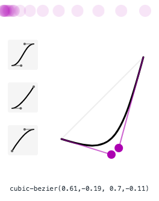
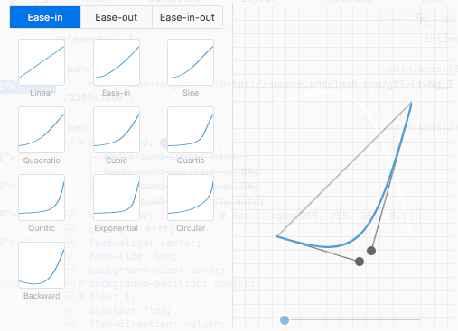
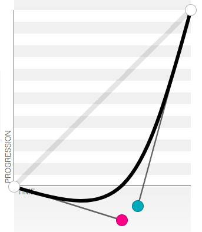

<div class="blog-header-image">
  
</div>

This was another super fun exercise from Wes Bos's [Javascript 30](https://javascript30.com) course, focused on going through vanilla JavaScript fundamentals without using frameworks or libraries.

In it, we're creating an image gallery that will expand and animate on click...lots of cool stuff here!

You can check it out on:

[Codepen](https://codepen.io/whyohengee/pen/gzZaro?editors=0100)

[Github Pages](https://whyohengee.github.io/flexpanelsgallery/)

[Github Repo](https://github.com/whyohengee/flexpanelsgallery/)


## Flexbox lessons
I love [flexbox](https://css-tricks.com/snippets/css/a-guide-to-flexbox/). It helps so much in not only understanding layout, but giving you some built-in flexibility when it comes to differing viewports.

A couple of things to remember:


### Nesting flex containers
An element can be both a flexbox child and a container. As a child, it will go with whatever flex behaviors its parent has set, and can set its own parent behaviors for *its* children.

In this example, we have three layers of nested flex containers:

1. `.panels`
This holds all of the individual panels. We want them all to take up an even amount of space.

2. `.panel`
We make this a flex container also, and set the `flex-direction` to be a column, and to make everything centered...this is what will keep the text in each panel aligned vertically.

3. `panel > *`
All of the items within the panel, in this case the text, will be even spaced now. We're setting the same `flex: 1` rule here (see the "Setting flex values") section.


### Setting flex values
The [`flex` property is shorthand](https://css-tricks.com/snippets/css/a-guide-to-flexbox/#article-header-id-13) for three properties: `flex-grow`, `flex-shrink`, and `flex-basis`. The default value is:

```css
flex: 0 1 auto
```

The [`flex-grow` value](https://css-tricks.com/snippets/css/a-guide-to-flexbox/#article-header-id-10) is a number that tells the browser how much space to give each element within the flex container as it grows. The number isn't a specific unit, but a ratio. If all of the elements have a value of 1, they'll all grow equally. If one of them has a value of 2, that element will take up twice as much space (or as close as possible).

The [`flex-shrink` value](https://css-tricks.com/snippets/css/a-guide-to-flexbox/#article-header-id-11) is similar, but addresses how those elements will shrink.

The [`flex-basis` value](https://css-tricks.com/snippets/css/a-guide-to-flexbox/#article-header-id-12) is the default size of the element before the remaining space is distributed. If this value is `auto`, the remaining space is based on the `flex-grow` value.

I think you can do a lot by just setting the `flex-grow` value, so something like this:

```css
flex: 1
```

This gives all elements within the container equal space.


## Animating with CSS transitions: how I explain it to myself
We're using CSS Transitions for the exansion/shrinking of the panel, and for moving text within each panel.

[CSS transitions](https://developer.mozilla.org/en-US/docs/Web/CSS/CSS_Transitions/Using_CSS_transitions) let you control *how* an element moves between two states, and *how long* it will take to make that change. The animated changes between the two states are done by the browser. We can add a transition rule to elements we want to move between 2 states. A transition rule looks like this:

```css
.className {
  transition: all .5s ease-in-out;
}
```

 The *how* part can be defined with an easing function, and the *how long* part is defined in terms of seconds.

So the transitions that happen with this gallery are that when you click on one of the panels, it will expand to a wider width, and text will appear into view from the top and bottom and scale to be bigger. Here's how I try to explain the process to myself:

1. We first need decide what properties we want to transition (size? color? position? Here's [a complete list of things you can transition](https://developer.mozilla.org/en-US/docs/Web/CSS/CSS_animated_properties)). We'll need to write the default state (state 1) in one class, and the ending state (state 2) in another class. Wherever it is we write state 1, we'll need to add the `transition` property, including what's transitioning, how long, and how (easing function optional).

2. With JavaScript, we'll write event handlers that will toggle between state 1 and state 2...simply put, we're just adding or removing the state 2 class.


## Moving the text from off-screen to on-screen
The first and last lines of text in each panel will be off-screen. When we click on a panel, the lines will move on-screen. We can use CSS transform `translateY` to handle the initial, state 1 positions:

```css
.panel > *:first-child {
  transform: translateY(-100%); //1st line of text, out of view above
}
```

```css
.panel > *:last-child {
  transform: translateY(100%); //last line of text, out of view below
}
```

What we want to happen on a click event is to add these state 2 classes:

```css
.panel.open-active > *:first-child {
  transform: translateY(0); //Moves 1st line of text into view from above
}

.panel.open-active > *:last-child {
  transform: translateY(0); //Moves last line of text into view from below
}
```

Since we define state 1 in the `.panel > *` selector (ok technically, state 1 is being defined in `:first-child` and `:last-child` pseudo elements, but the the `.panel > *` selector is acting like a parent selector), that's also where we want to add the transition property, like so:

```css
.panel > * {
  transition: transform .5s;
}
```

This is saying the only property that will transition for each `.panel` will be the transform value, and that it will take .5 seconds to move.


### Expanding the panels and scaling the text
We also want these panels to expand and the text to scale. We can write the state 2 class for these properties like so:

```css
.panel.open {
  flex: 5;
  font-size: 2em;
}
```

So what `flex: 5` does is change the flex ratio of that element...if the other flex items have a value of 1, the element with `flex: 5` will take up 5 times the space.

The state 1 properties were defined on `.panel`, and we can define the transitions in that rule. Instead of transitioning all properties, we can define specific properties to transition, and apply *how* they move via a cubic-bezier easing function; so within `.panel`:

```css
transition:
  font-size .5s cubic-bezier(0.61,-0.19, 0.7,-0.11),
  flex .5s cubic-bezier(0.61,-0.19, 0.7,-0.11),
  background .5s;
```

One thing that I tripped up on a couple of times is the syntax. You can define multiple properties to transition through a comma-separated list. Note though that there isn't a `:` after the property name; it's just the name, the duration, and the easing function if any.

The `font-size` and `flex` properties are intuitive—we know what transitioning these will look like. But why do we have to transition the `background` property too? And why isn't there an easing function associated with it?

If you don't include `background`, there won't be a smooth transition—the panel just kind of pops open and closed. Adding that allows the transition to happen smoothly. Try removing it in dev tools to get an idea.

And with the easing function, we're using `cubic-bezier`. In both Chrome's and Firefox's dev tools, you can edit the function. You'll need to supply some initial values in your CSS, but if you have those, you can click a little icon in dev tools that gives you an interface that looks like this (Chrome's is on top, Firefox's is bottom):





I kind of like Firefox's version better at this point; there was more screen real estate, and there was a little looping animation that let you see the behavior of the movement over and over (Chrome's played it once).

I also liked the easing function that Wes Bos used in his original demo: [it has a cool little stutter at the beginning, then accelerates quickly the rest of the way](http://cubic-bezier.com/?#.61,-0.19,.7,-0.11).

I'm trying to better understand how to quickly read and edit these visual interpretations. This one, for example, has its curve dip at the beginning, then shoots upward:



The more of these I see, the better I'll be able to intuit how it translates in the browser when applied to different properties.


## JavaScript to handle the click events and toggle the state 2 classes
Alright, let's get into the script that will handle the adding/removing of the state 2 classes.

The first thing we want to do is grab all of the panels so we can listen to them:

```js
const panels = document.querySelectorAll('.panel')
```

There are two classes that we want to toggle: `.open` (to expand the panels and scale the text) and `.open-active` (to move the first and last lines from off-screen to on-screen). We can create a handler to do this like so:

```js
function toggleOpen() {
  this.classList.toggle('open');
}
```

and we can add the event handler to each panel that will call this function on click:

```js
panels.forEach(panel => panel.addEventListener('click', toggleOpen))
```

For the `.open-active` class, we want the text to move in *after* the panel has expanded. So we're not listening for a click event, we're listening for an event called [`transitionend`](https://developer.mozilla.org/en-US/docs/Web/Events/transitionend).

The tricky thing with this is that there will be multiple transitions happening. Remember how for `.panel`, we defined transition to be:

```css
  transition:
    font-size .5s cubic-bezier(0.61,-0.19, 0.7,-0.11),
    flex .5s cubic-bezier(0.61,-0.19, 0.7,-0.11),
    background .5s;
```

In the handler, we need to figure out which of these transitions we want to listen for. How do we figure that out? We can do some console logging to see...first, we'll need to define the event handler:

```js
panels.forEach(panel => panel.addEventListener('transitionend', toggleActive))
```

Then, in the handler, we can do something like this to console log:

```js
function toggleActive(e) {
  console.log(e.propertyName);
}
```
Here's what we'd see in Chrome dev tools:

```
flex-grow
font-size
```

We're only interested in the `flex-grow` property. There's some browser discrepancy, btw, in the flex-grow property...Safari calls it `flex`, while Chrome/Firefox call it `flex-grow`. We can manage that discrepancy by using JavaScript's [`String.includes()`](https://developer.mozilla.org/en-US/docs/Web/JavaScript/Reference/Global_Objects/String/includes) function:

```js
function toggleActive(e) {
  if (e.propertyName.includes('flex')) {
    this.classList.toggle('open-active');
  }
}
```

So now, when you click on a panel, the first/last lines won't move into view until *after* the panel expand transition has completed. And the same for the reverse: When you click an expanded panel, the text won't move off-screen until the panel has collapsed to its original width.


## Resources
<div class="resources">
  <ul>
    <li><a href="https://javascript30.com">JavaScript 30</a></li>
    <li><a href="https://css-tricks.com/snippets/css/a-guide-to-flexbox/">CSS-Tricks: A complete guide to flexbox</a></li>
    <li><a href="https://css-tricks.com/snippets/css/a-guide-to-flexbox/#article-header-id-13">CSS-Tricks: flex shorthand</a></li>
    <li><a href="https://developer.mozilla.org/en-US/docs/Web/CSS/CSS_Transitions/Using_CSS_transitions">MDN: Using CSS Transitions</a></li>
    <li><a href="https://developer.mozilla.org/en-US/docs/Web/CSS/CSS_animated_properties">MDN: List of animated properties</a></li>
    <li><a href="https://developer.mozilla.org/en-US/docs/Web/Events/transitionend">MDN: transitionend event</a></li>
    <li><a href="https://developer.mozilla.org/en-US/docs/Web/JavaScript/Reference/Global_Objects/String/includes">MDN: String.includes</a></li>
  </ul>
</div>