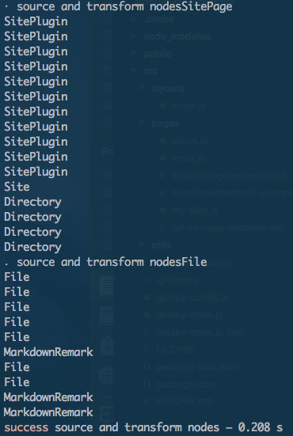
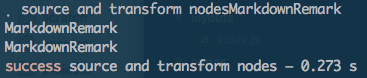
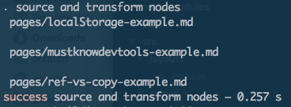
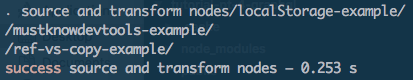
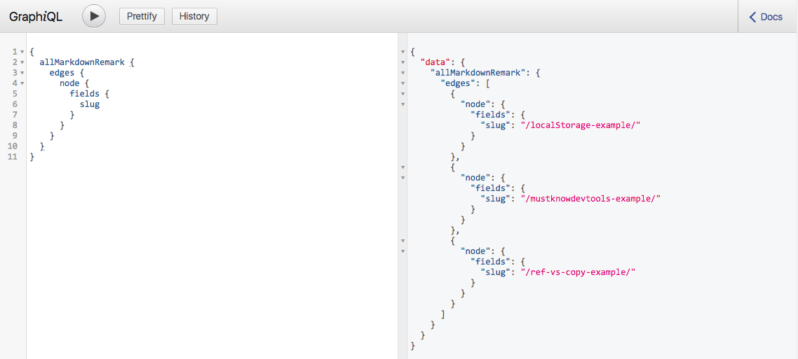
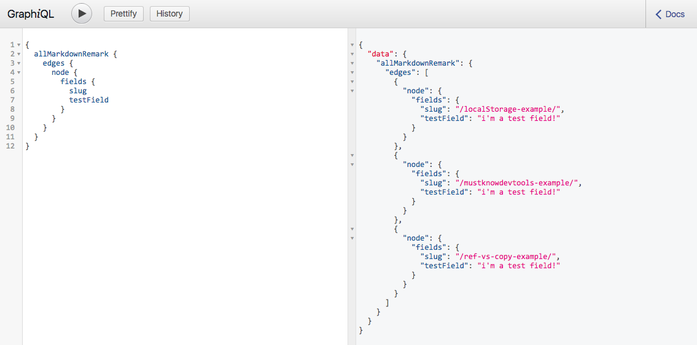

<div class="blog-header-image">
  
</div>


Gatsby's been fun to learn, and the [tutorial](https://www.gatsbyjs.org/tutorial/) has been helpful, but I had to take some time to understand the process to create pages from existing data—namely, markdown files. It's a two-step process:

1. Generate the "path" or "slug" for the page
2. Create the page

This post goes deeper into the first section of [Part 7 of the Gatsby tutorial]((https://www.gatsbyjs.org/tutorial/part-seven/)), "Creating slugs for pages."

I'm following the steps in the tutorial, but writing down a lot of the detail that I may forget in the future...basically, I'm explaining this to my future self and anyone else it might help.


## Where we're at so far: plugins to install
Remember:

[Source plugins fetch data from their source.](https://www.gatsbyjs.org/tutorial/part-five/) For example the filesystem source plugin knows how to fetch data from the file system. The WordPress plugin knows how to fetch data from the WordPress API.

[Transformer plugins take the raw content from source plugins and transform it into something more usable](https://www.gatsbyjs.org/tutorial/part-six/#transformer-plugins)...for example, we can take Markdown files and access the content within them to populate our blog posts.

You can use a combination of source plugins to bring data into the site and get info *about* the files, then transformer plugins to work with the data *within* the files your Gatsby site.

So let's say we've already installed a source plugin to work with our filesystem—[gatsby-source-filesystem](https://www.gatsbyjs.org/packages/gatsby-source-filesystem/)—and a transformer plugin to work with our markdown files—[gatsby-transformer-remark](https://www.gatsbyjs.org/packages/gatsby-transformer-remark/).

What we want to do now is programmatically map our data—our markdown files—into pages for the site.


## Gatsby APIs
Since Gatsby uses [GraphQL](http://graphql.org/), pretty much everything—plugins, pages, layout components, etc—is considered a "node."

We'll need to use two of [Gatsby's built-in APIs](https://www.gatsbyjs.org/docs/node-apis/) to create pages from markdown files: [`onCreateNode`](https://www.gatsbyjs.org/docs/node-apis/#onCreateNode) and [`createPages`](https://www.gatsbyjs.org/docs/node-apis/#createPages).

For the purpose of generating slugs for our pages, I'm only focusing on the `onCreateNode` API in this post. I'll write a [post later that explains the `createPages` API](creating-pages-from-markdown-files-in-gatsby).

Each time a node in your Gatsby site is created, `onCreateNode` is called. The docs also say that we need to use this API whenever we want to extend or transform nodes created by other plugins...since we'll be modifying our Markdown nodes (which utilize the [gatsby-transformer-remark](https://www.gatsbyjs.org/packages/gatsby-transformer-remark/) plugins), we'll need to implement this API.


## Where to implement `onCreateNode`
To do that, we'll need a `gatsby-node.js` file at the root of our project. This is where we can export a function to implement `onCreateNode`:

```js
exports.onCreateNode = () => {};
```

We're going to pass in an argument—`node`—to this exported function. Add this to our exported function, then stop and restart the development server to console log what we get (this isn't logging to the browser console, by the way; it's logging to your terminal console):

```js
exports.onCreateNode = ({node}) => {
  console.log(node.internal.type);
};
```

What you should see is that when the `source and transform nodes` task runs, a bunch of nodes will show (note there's no line break between the end of the task name and the first node type). Here's a screencap of what I got:




## We're focusing on the Markdown nodes
There are a bunch of node types: SitePage, SitePlugin, Site, Directory, File, and MarkdownRemark. The MarkdownRemark nodes are the ones we're interested in to create our slugs...so:

```js
exports.onCreateNode = ({node}) => {
  if (node.internal.type === 'MarkdownRemark') {
    console.log(node.internal.type);
  }
};
```

Now, if we restart the dev server, we should see only nodes of the type MarkdownRemark:




## File names are going to be the slugs 🐌 (sadly, there are no slug emojis)
We want the name of the markdown file to be the slug...so if we have a post written in a markdown file called 'we-need-slug-emojis.md', the name of the page will be 'mygatsbysite.com/we-need-slug-emojis'.

So how do we grab the filenames?

[The docs say](https://www.gatsbyjs.org/tutorial/part-seven/#creating-slugs-for-pages):

<div class="quote">"To get it [the filename], we need to traverse the “node graph” to its parent `File` node, as `File` nodes contain data we need about files on disk."</div>

To do this, we're passing a second argument into our exported function, a method called `getNode`. We're going to use that method to do the traversing of the node graph and get to the parent `File` node. Let's output the relative path to that `File` node:

```js
exports.onCreateNode = ({node, getNode}) => {
  if (node.internal.type === 'MarkdownRemark') {
    const fileNode = getNode(node.parent);
    console.log('\n', fileNode.relativePath);
  }
};
```

Stop/start the dev server, and you should see the nodes' parent `File` nodes (when I went through the tutorial, I added some test .md files, which you're seeing here):



## Creating our slugs 🐌
The tutorial mentions that the logic for creating slugs from file names can be tricky, so they recommend using the [gatsby-source-filesystem](https://www.gatsbyjs.org/packages/gatsby-source-filesystem/) plugin, which we installed earlier.


That source plugin includes a method called [`createFilePath`](https://www.gatsbyjs.org/packages/gatsby-source-filesystem/#createfilepath). To use it, we import the module using `require`, which I thought was weird because we've been using `import` on all of our other files so far. I need to research why we're loading this differently. But for now...

To use the `createFilePath` function (note the use of backticks around `pages`):

```js
const {createFilePath} = require('gatsby-source-filesystem');

exports.onCreateNode = ({node, getNode}) => {
  if (node.internal.type === 'MarkdownRemark') {
    console.log(createFilePath({node, getNode, basePath: `pages`}));
  }
};
```

We're passing an object with 3 values into`createFilePath`:

* `node`, the node we want to convert to a path (eg, a markdown node)
* `getNode`, the method used to get a node...remember, this was the second argument in our exported function, `onCreateNode`
* `basePath`, which is the base path for our files. This defaults to `/src/pages`.

There's also an optional fourth argument, `trailingSlash`, which uses a Boolean to define whether you want the path to contain a trailing slash. It defaults to true.

So this method nicely performs the jobs of finding the parent `File` node and creating the slug. The output should show our final slugs:




## Adding the slugs to our MarkdownRemark nodes
This was a concept I wasn't used to and had to sit down with for a bit.

Remember how everything is a node? We have our MarkdownRemark nodes, whose parent is the `File` node with the data. We want the slugs to be associated with the MarkdownRemark nodes.

To do this, we have to create new fields for these nodes, which has to be done through a function called [`createNodeField`](https://www.gatsbyjs.org/docs/bound-action-creators/#createNodeField). The reason for this is because only the original creator of a node can modify that node. All other plugins—including our `gatsby-node.js`—has to use the `createNodeField` function to extend nodes.

Before using `createNodeField`, we need to do is pass a third argument into `onCreateNode`, an object called [`boundActionCreators`](https://www.gatsbyjs.org/docs/bound-action-creators/). I learned this is associated with [Redux](https://redux.js.org/), which is a way to manage state in React apps.

Since Gatsby uses Redux, when you implement a Gatsby API (like `onCreateNode`), you're passed a collection of "Bound Action Creators," which are functions that create and dispatch Redux actions when called. The object `boundActionCreators` is the third argument we pass into `onCreateNode`, and the `createNodeField` method can be extracted from it using [object destructuring](https://www.youtube.com/results?search_query=es6+object+destructuring). We're using the `createNodeField` method to create our custom slug fields, specifying which node to create the field for, the name of the new field, and the value for the new field.

Ok, here we go:

```js
const {createFilePath} = require('gatsby-source-filesystem');

exports.onCreateNode = ({node, getNode, boundActionCreators}) => {
  const {createNodeField} = boundActionCreators;
  if (node.internal.type === 'MarkdownRemark') {
    const slug = createFilePath({node, getNode, basePath: `pages`});
    createNodeField({
      node,
      name: `slug`,
      value: slug
    });
  }
};
```


## Viewing our new fields in GraphiQL
I haven't mentioned in this post yet the awesome Gatsby feature of [GraphiQL](https://www.gatsbyjs.org/docs/graphql-reference/), an interactive editor included with the development server. You can access it using `http://localhost:8000/___graphql`.

We can enter this GraphQL query to see our new fields...the query is on the left, and the results are on the right:



Using this method, we can add whatever custom fields we want...here, I'm adding a new field called "test field":

```js
const {createFilePath} = require('gatsby-source-filesystem');

exports.onCreateNode = ({node, getNode, boundActionCreators}) => {
  const {createNodeField} = boundActionCreators;
  if (node.internal.type === 'MarkdownRemark') {
    const slug = createFilePath({node, getNode, basePath: `pages`});
    createNodeField({
      node,
      name: `slug`,
      value: slug
    });
    createNodeField({
      node,
      name: `testField`,
      value: `i'm a test field!`
    });
  }
};
```

And we can view this new field with this query:



Ok, so that's how we get the slugs!

Next up is [creating the pages from our markdown files](creating-pages-from-markdown-files-in-gatsby).


## References
<div class="resources">
  <li><a href="https://www.gatsbyjs.org/tutorial/">Gatsby JS Tutorial</a></li>
  <li><a href="https://www.gatsbyjs.org/packages/gatsby-source-filesystem/">gatsby-source-filesystem Plugin</a></li>
  <li><a href="https://www.gatsbyjs.org/packages/gatsby-transformer-remark/">gatsby-transformer-remark Plugin</a></li>
  <li><a href="http://graphql.org/">GraphQL</a></li>
  <li><a href="https://www.gatsbyjs.org/docs/node-apis/">Gatsby JS APIs</a></li>
</div>