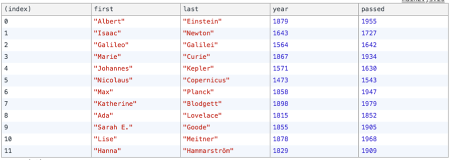
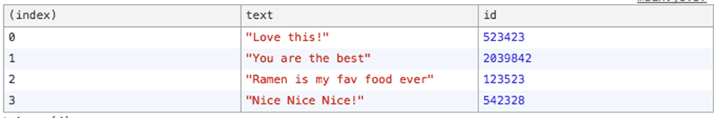

<div class="blog-header-image">
  
</div>


If you've worked with data in JavaScript, you've almost definitely worked with [Arrays](https://developer.mozilla.org/en-US/docs/Web/JavaScript/Reference/Global_Objects/Array). Although I had some familiarity with `Array.reduce()`, `Array.map()`, and `Array.filter()`, there was a lot more ways to work with Arrays than I knew. [Wes Bos](https://twitter.com/wesbos/) has a great course, [JavaScript 30](https://javascript30/), that goes through JS fundamentals without using any frameworks or libraries. These exercises were part of the course.

As always, I like to blog it out to get it deeper into my brain, and to do Future Me a favor in case Present Me forgets (which he always does).

In this post, I'm going to work with these sample arrays:

```js
// Sample Arrays
const inventors = [
      { first: 'Albert', last: 'Einstein', year: 1879, passed: 1955 },
      { first: 'Isaac', last: 'Newton', year: 1643, passed: 1727 },
      { first: 'Galileo', last: 'Galilei', year: 1564, passed: 1642 },
      { first: 'Marie', last: 'Curie', year: 1867, passed: 1934 },
      { first: 'Johannes', last: 'Kepler', year: 1571, passed: 1630 },
      { first: 'Nicolaus', last: 'Copernicus', year: 1473, passed: 1543 },
      { first: 'Max', last: 'Planck', year: 1858, passed: 1947 },
      { first: 'Katherine', last: 'Blodgett', year: 1898, passed: 1979 },
      { first: 'Ada', last: 'Lovelace', year: 1815, passed: 1852 },
      { first: 'Sarah E.', last: 'Goode', year: 1855, passed: 1905 },
      { first: 'Lise', last: 'Meitner', year: 1878, passed: 1968 },
      { first: 'Hanna', last: 'Hammarström', year: 1829, passed: 1909 }
    ];

    const people = ['Beck, Glenn', 'Becker, Carl', 'Beckett, Samuel', 'Beddoes, Mick', 'Beecher, Henry', 'Beethoven, Ludwig', 'Begin, Menachem', 'Belloc, Hilaire', 'Bellow, Saul', 'Benchley, Robert', 'Benenson, Peter', 'Ben-Gurion, David', 'Benjamin, Walter', 'Benn, Tony', 'Bennington, Chester', 'Benson, Leana', 'Bent, Silas', 'Bentsen, Lloyd', 'Berger, Ric', 'Bergman, Ingmar', 'Berio, Luciano', 'Berle, Milton', 'Berlin, Irving', 'Berne, Eric', 'Bernhard, Sandra', 'Berra, Yogi', 'Berry, Halle', 'Berry, Wendell', 'Bethea, Erin', 'Bevan, Aneurin', 'Bevel, Ken', 'Biden, Joseph', 'Bierce, Ambrose', 'Biko, Steve', 'Billings, Josh', 'Biondo, Frank', 'Birrell, Augustine', 'Black Elk', 'Blair, Robert', 'Blair, Tony', 'Blake, William'];
```


## `console.table()`
Instead of `console.log()`, you can use `console.table()`, which outputs stuff to the console in a nice table format. Super useful 👍

If we were to `console.log` the `inventors` dataset, for example, it would look like this:



Nicely formatted!


## `Array.reduce()`
I found that after these exercises, I felt much more comfortable with `Array.reduce()`. What this method does is take a collection and reduce it down to a single value. This was a [good post that explained](https://www.airpair.com/javascript/javascript-array-reduce) if you've ever done something like this (and haven't we all?):

```js
var total = 0;
var numbers = [1, 5, 7, 3, 8, 9];
for ( var i = 0; i < numbers.length; i++ ){
    total += numbers[i];
}
```

then you're doing something similar to `Array.reduce()`.

Here's what that would look like:

```js
let sum = [1,2,3].reduce((total, num) => {return total + num}, 0);
```

Here,  the `sum` variable ends up with a single value. The first argument to `.reduce()` is a callback, and the second argument—here, 0—is a starting value, which is represented by the argument `total`. Each time the array is looped through, `total` is brought through with the new value.

Also, you can use objects, not just single numbers, as the return value, which is kind of exciting to think how powerful it can be.


## `Array.map()`
A really helpful thing to understand about `Array.map()` is that it will return an array of the same length you start with: you're just going over each value in the original array and doing something to it so you end up with a modified array of the same length. That helped me conceptually.

[Here's an example](https://www.discovermeteor.com/blog/understanding-javascript-map):

```js
const incrementByOne = [1, 2, 3, 4].map((num) => { return num + 1; });
//returns [2, 3, 4, 5]
```

## Array.sort()
It's kind of embarrassing to mention, but I didn't have a really strong grasp of how JavaScript's `Array.sort()` function worked. I've used it before for basic sorting—and by basic, I mean like sorting an array by alphabetical order—but I wanted to dig a little deeper.

So by default, `Array.sort()` will sort things lexicographally, or in dictionary order. This happens if you don't write a callback within `Array.sort()`.

But if you wanted more control, you *can* write a callback, which serves as a comparison function. Here's what the basic structure of that would look like

```js
let sorted = [200, 100, 500, 700].sort( (a, b) => {
  if (a < b) { return -1; }
  else if (a > b) { return 1; }
  else { return 0; }
})
console.log(sorted); //[ 100, 200, 500, 700 ]
```

Note that there are 2 arguments passed into the function: a and b, which will be the first and next items. The sorting function starts at the beginning and compares the first two items. Here's the sorting logic from above:

  * If the function *returns less than zero*, sort a before b.
  * If the function *returns greater than zero*, sort b before a.
  * If the function *returns zero*, then leave a and b where they are.

I was still pretty confused, so I explained it to myself this way:

Imagine a number line:


* If a < b, then we want a to be placed before b. In that case, returning -1 would place it before (-1 is to the left of 0 and 1).
* If a > b, then we want a to be placed after b. In that case, returning 1 would place it after (1 is to the right of -1 and 0).
* If a = b, then we want them to remain the same (0 is right between -1 and 1).

I don't know if this is useful, but it helped me wrap my mind around the concept.

The [MDN documentation on `Array.sort()`](https://developer.mozilla.org/en-US/docs/Web/JavaScript/Reference/Global_Objects/Array/sort) has an even simpler syntax:

```js
function compareNumbers(a, b) {
  return a - b;
}
```

Let's say you have an array: `[8, 5]`. If you plug in the numbers: `a = 8` and `b = 5`, then 8 - 5 would return 3, which is greater than zero, so b would be sorted after a.

To reverse the direction of the sort (ie, sort from greatest to least values), simply reverse the return statement:

```js
function compareNumbers(a, b) {
  return b - a;
}
```

So with this example array: `[9, 13]`, with `a = 9` and `b = 13`; 13 - 9 = 4, which is greater than zero, so b would be sorted after a.


I remember learning how the bubble sort algorithm works, and it seems this is an example of that.


## A little lesson with Arrow functions and ternary operators
Quick aside from Arrays for a sec.

Did you know that:

1. With [ES6 arrow functions](https://developer.mozilla.org/en-US/docs/Web/JavaScript/Reference/Functions/Arrow_functions), if you use curly braces around the statements (ie, block body), you need an explicit `return` statement. In the more concise version (just one statement) without the curly braces, the `return` statement is implied.

2. [With ternary operators, the `return` statement comes before the condition](https://developer.mozilla.org/en-US/docs/Web/JavaScript/Reference/Operators/Conditional_Operator#Returning_Ternary_Statements).

So this didn't work:

```js
let birthyear_sort = inventors.sort( (a, b) =>
  {a.year < b.year ? -1 : 1;}
);
```

because there wasn't a return statement. However, this would work:

```js
let birthyear_sort = inventors.sort( (a, b) =>
  a.year < b.year ? -1 : 1
);
```

...because of the absence of the curly braces, you don't need a `return` statement.

If you were to use the curly braces (which I'm used to doing—it just makes it easier to interpret imo) and a ternary operator, here's how it would look:

```js
let birthyear_sort = inventors.sort( (a, b) =>
  {return a.year < b.year ? -1 : 1;}
);
```

## Turning NodeLists into Arrays
If you were to grab a set of elements using `document.querySelectorAll()`, what's returned isn't an Array. the NodeList has some methods, like `length`, but no way to loop over them like `.forEach()`, and we wouldn't be able to use handy Array methods like `.map()`. BUT you can create an Array from a NodeList like so using [`Array.from()`](https://developer.mozilla.org/en-US/docs/Web/JavaScript/Reference/Global_Objects/Array/from):

```js
let categories = document.querySelectorAll('.mw-category');
Array.isArray(categories); //false
let links = Array.from(categories);
Array.isArray(links); //true
```

## `String.includes()` (this isn't about Arrays, but still cool)
This `String` method lets you search for a string within a string with the [`String.includes()`](https://developer.mozilla.org/en-US/docs/Web/JavaScript/Reference/Global_Objects/String/includes) method. This will return true if a substring is contained in a larger string, but it's case-sensitive. Easier than writing a regular expression:

```js
'Blue Whale'.includes('Blue'); //true
'Blue Whale'.includes('blue'); //false
```


## `.textContent` (also not about Arrays, but also cool)
If you inspect a `<a>` tag in dev tools, you'll see a list of properties. Say you want the link text; I've always used `.innerHTML`, but you can also use [`.textContent`](https://developer.mozilla.org/en-US/docs/Web/API/Node/textContent), which has the save value. Not sure if there's an advantage to using one over the other, but interesting to know.


## `Array.some()`
The [`Array.some`](https://developer.mozilla.org/en-US/docs/Web/JavaScript/Reference/Global_Objects/Array/some) method tests whether at least one element in the array passes the test implemented by the provided function.

Example:

```js
function isBiggerThan10(element, index, array) {
  return element > 10;
}

[2, 5, 8, 1, 4].some(isBiggerThan10);  // false
[12, 5, 8, 1, 4].some(isBiggerThan10); // true
```

Ok, when I first read this, I was like "How is this different from `Array.filter()`? But looking at the example, `.some()` returns a Boolean.


## `Array.every()`
The [`Array.every`](https://developer.mozilla.org/en-US/docs/Web/JavaScript/Reference/Global_Objects/Array/every) method tests whether all elements in the array pass the test implemented by the provided function.

Example:

```js
function isBelowThreshold(currentValue) {
  return currentValue < 40;
}

var array1 = [1, 30, 39, 29, 10, 13];

console.log(array1.every(isBelowThreshold));
// expected output: true
```


## `Array.find()`
The [`Array.find`](https://developer.mozilla.org/en-US/docs/Web/JavaScript/Reference/Global_Objects/Array/find) method returns the *value* of the first element in the array that satisfies the provided testing function. Otherwise, `undefined` is returned.

Example:

```js
function isBigEnough(element) {
  return element >= 15;
}

[12, 5, 8, 130, 44].find(isBigEnough); // 130
```

## `Array.findIndex()`
The [`Array.findIndex`](https://developer.mozilla.org/en-US/docs/Web/JavaScript/Reference/Global_Objects/Array/findIndex) method returns the *index* of the first element in the array that satisfies the provided testing function. Otherwise, -1 is returned.

Example:

```js
var array1 = [5, 12, 8, 130, 44];

function findFirstLargeNumber(element) {
  return element > 13;
}

console.log(array1.findIndex(findFirstLargeNumber));
// expected output: 3
```


## Removing a specific element from an array using either `Array.splice` or `Array.slice`
The first thing we want to do is find the index of the element we want to remove. Let's say we have the dataset:

```js
const comments = [
  { text: 'Love this!', id: 523423 },
  { text: 'Super good', id: 823423 },
  { text: 'You are the best', id: 2039842 },
  { text: 'Ramen is my fav food ever', id: 123523 },
  { text: 'Nice Nice Nice!', id: 542328 }
];
```

and we want to remove the element with id '823423', we can:

```js
let deleteThisIndex = comments.findIndex( elem => elem.id === 823423);
```

To delete the index, there are two ways to go about this. We can use either [`Array.splice()`](https://developer.mozilla.org/en-US/docs/Web/JavaScript/Reference/Global_Objects/Array/splice), which will modify the orginal array, or create a new array and remove it using [`Array.slice()`](https://developer.mozilla.org/en-US/docs/Web/JavaScript/Reference/Global_Objects/Array/splice).

Here's an example using `.splice`:

```js
var myFish = ['angel', 'clown', 'mandarin', 'sturgeon'];

myFish.splice(2, 0, 'drum'); // insert 'drum' at 2-index position
// myFish is ["angel", "clown", "drum", "mandarin", "sturgeon"]

myFish.splice(2, 1); // remove 1 item at 2-index position (that is, "drum")
// myFish is ["angel", "clown", "mandarin", "sturgeon"]
```

If we use `Array.splice()`, we'll be changing the contents of the original array. So with the `comments` array, we want to remove the index stored at `deleteThisIndex`:

```js
comments.splice(deleteThisIndex, 1);
console.table(comments);
```

would show:



The `slice()` method returns a shallow copy of a portion of an array into a new array object selected from `begin` to `end` (`end` not included). The original array will not be modified.

Example:

```js
var animals = ['ant', 'bison', 'camel', 'duck', 'elephant'];

console.log(animals.slice(2));
// expected output: Array ["camel", "duck", "elephant"]

console.log(animals.slice(2, 4));
// expected output: Array ["camel", "duck"]

console.log(animals.slice(1, 5));
// expected output: Array ["bison", "camel", "duck", "elephant"]
```

In our example with the `comments` array, the first thing we would need to do is create a new array to hold the new, modified array:

```js
let modified array = [];
```

This won't work—it will give us an array of 2 arrays. We have to use the [spread operator (`...`)](https://www.youtube.com/results?search_query=es6+spread+operator) so that these elements are expanded as individual elements:

```js
let modifiedArray = [
  ...comments.slice(0, deleteThisIndex),
  ...comments.slice(deleteThisIndex + 1)
];
```

The first `.slice()` is adding/expanding all of the elements from the beginning of the original array up to the index we want to remove, and the second `.slice()` is adding/expanding all of the elements after the index we want to remove. We'll have 2 arrays now: the original `comments`, and the new `modifiedArray`.


Ok...super long post, but Arrays are really important!!


### Resources
<div class="resources">
  <ul>
    <li><a href="https://developer.mozilla.org/en-US/docs/Web/JavaScript/Reference/Global_Objects/Array">MDN: JavaScript Array</a></li>
    <li><a href="https://javascript30.com/">JavaScript 30</a></li>
    <li><a href="https://www.airpair.com/javascript/javascript-array-reduce">Understand JavaScript Array Reduce in 1 Minute</a></li>
    <li><a href="https://www.discovermeteor.com/blog/understanding-javascript-map">Discover Meteor: Array.map</a></li>
    <li><a href="https://developer.mozilla.org/en-US/docs/Web/JavaScript/Reference/Global_Objects/Array/sort">MDN: Array.sort</a></li>
    <li><a href="https://developer.mozilla.org/en-US/docs/Web/JavaScript/Reference/Functions/Arrow_functions">MDN: Arrow functions</a></li>
    <li><a href="https://developer.mozilla.org/en-US/docs/Web/JavaScript/Reference/Operators/Conditional_Operator#Returning_Ternary_Statements">MDN: Returning ternary statements</a></li>
    <li><a href="https://developer.mozilla.org/en-US/docs/Web/JavaScript/Reference/Global_Objects/Array/from">MDN: Array.from</a></li>
    <li><a href="https://developer.mozilla.org/en-US/docs/Web/API/Node/textContent">MDN: Node.textContent</a></li>
    <li><a href="https://developer.mozilla.org/en-US/docs/Web/JavaScript/Reference/Global_Objects/Array/some">MDN: Array.every</a></li>
    <li><a href="https://developer.mozilla.org/en-US/docs/Web/JavaScript/Reference/Global_Objects/Array/find">MDN: Array.find</a></li>
    <li><a href="https://developer.mozilla.org/en-US/docs/Web/JavaScript/Reference/Global_Objects/Array/findIndex">MDN: Array.findIndex</a></li>
    <li><a href="https://developer.mozilla.org/en-US/docs/Web/JavaScript/Reference/Global_Objects/Array/splice">MDN: Array.splice</a></li>
    <li><a href="https://developer.mozilla.org/en-US/docs/Web/JavaScript/Reference/Global_Objects/Array/slice">MDN: Array.slice</a></li>
    <li><a href="https://www.youtube.com/results?search_query=es6+spread+operator">YouTube videos on ES6 spread operator</a></li>
  </ul>
</div>
