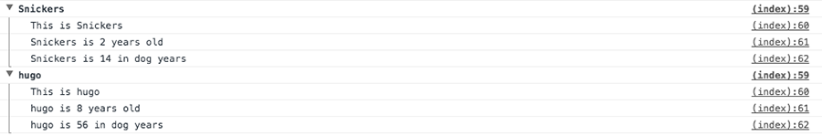
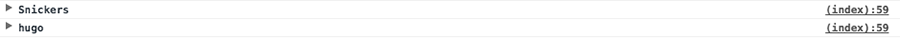
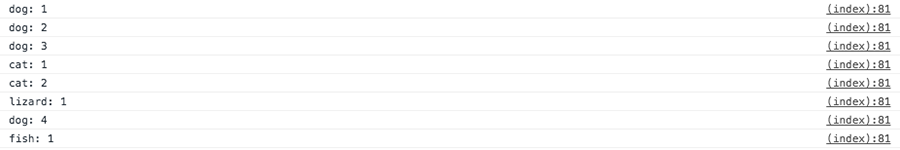
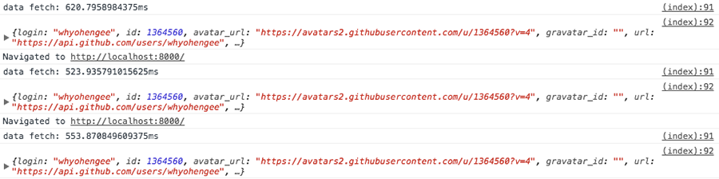
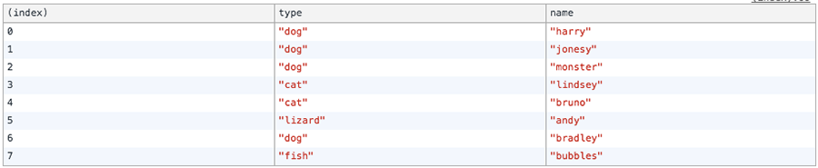
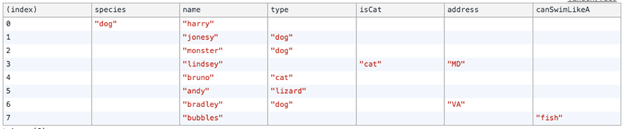

<div class="header-image">
  
</div>


If you've worked with JavaScript, then you've done some debugging with `console.log`. [The JavaScript Console object](https://developer.mozilla.org/en-US/docs/Web/API/Console) provides access to the browser's debugging console.

Everyone knows `console.log()`, but there are a few that I didn't know about. In this post, all the stuff is in Chrome Dev Tools. I've been using Firefox Dev Tools a bit more, and I like using those, too. But for now, just focusing on Chrome's dev tools.


## Setting a breakpoint on HTML modifications
In dev tools Elements, right click on an element and you'll see an option called 'Break on' in the context menu. You'll have three options...you can set a breakpoint on subtree modifications, attribute modifications, and node removal.

Setting a breakpoint on attribute modifications is an easy way to step through the style changes an element might undergo. Kinda neat.


## Interpolate values into `console
So you can do something like this:

```js
console.log('Hello, I am an %s string', '👾') //emojis work
```

Here `%s` is a placeholder for a string, which can be defined as the second argument. I still prefer using [ES6 template literals](https://developer.mozilla.org/en-US/docs/Web/JavaScript/Reference/Template_literals) (backticks), but good to know this feature is available.


## Style text in the console
You can do that by placing `%c` at the beginning, and CSS rules as the second argument.

```js
console.log('%c Winter is coming', 'font-size: 20px; background: blue; color: gray; text-shadow: 5px 5px rgba(0, 0, 0, .25)');
```


## Show warnings
Like this:

```js
console.warn('Oh no');
```


## Testing if something is true or false
By using `console.assert()`, you can test if something is false and return a message. It won't return anything if it's true, only if it's false. So this won't produce anything:

```js
console.assert(1+1==2, 'Nope');
```

But this will produce 'Nope':

```js
console.assert(1+1==2, 'Nope');
```

A more practical application would be to check if an element contains a particular class:

```js
let p = document.querySelector('p');
console.assert(p.classList.contains('expanded'), 'That is false');
```

## Viewing stuff in a DOM element, including methods
Instead of using `console.log`, you can:

```js
console.dir(p);
```

This will show you all the properties of the element. You can open up `__proto__` to see all the methods.


## Grouping things together
Let's say you have an array:

```js
const dogs = [{ name: 'Snickers', age: 2 }, { name: 'hugo', age: 8 }];
```

and you want to loop over each one. But would you need a `console.log()` for each thing you want to view? Something like this?

```js
dogs.forEach(dog => {
  console.log(`This is ${dog.name}`);
  console.log(`${dog.name} is ${dog.age} years old`);
  console.log(`${dog.name} is ${dog.age * 7} in dog years`);
})
```

You could, but that could get pretty long, especially if you need to log more details (eg, if the object had more properties). Instead, you could use the `console.group()` approach, where you define a type of header to call the group. At the end of the group, which you use `console.groupEnd()` to define, you pass that name to signify the end of a group. Here's the same example as above, using `dog.name` as the header:

```js
dogs.forEach(dog => {
  console.group(`${dog.name}`);
  console.log(`This is ${dog.name}`);
  console.log(`${dog.name} is ${dog.age} years old`);
  console.log(`${dog.name} is ${dog.age * 7} in dog years`);
  console.groupEnd(`${dog.name}`);
})
```

That will output a nicely formatted dropdown like this:



You can also by default show the dropdowns collapsed by using `groupCollapsed()` instead:

```js
dogs.forEach(dog => {
  console.groupCollapsed(`${dog.name}`);
  console.log(`This is ${dog.name}`);
  console.log(`${dog.name} is ${dog.age} years old`);
  console.log(`${dog.name} is ${dog.age * 7} in dog years`);
  console.groupEnd(`${dog.name}`);
})
```

which will give you this output:




## `console.count()` will give you a count of occurrences
Let's say you have an array like this:

```js
const pets = [
  {type: "dog", name: "harry"},
  {type: "dog", name: "jonesy"},
  {type: "dog", name: "monster"},
  {type: "cat", name: "lindsey"},
  {type: "cat", name: "bruno"},
  {type: "lizard", name: "andy"},
  {type: "dog", name: "bradley"},
  {type: "fish", name: "bubbles"}
];
```

and you want to know how many instances of a "thing" you have in that array. You can use `console.count()` like so:

```js
pets.forEach(pet => {
  console.count(`${pet.type}`);
});
```

Which will output:




## Time how long something takes
I like this one a lot. The `console.time()` function will output how long something takes—like fetching a resource. The syntax requires a `console.time()` call to start it, and you pass in a string as an identifier...then when the thing you want to time is done, you call `console.timeEnd()` and pass in that same string identifier:

```js
console.time('data fetch');
fetch('https://api.github.com/users/whyohengee')
  .then(blob => blob.json())
  .then(data => {
    console.timeEnd('data fetch');
    console.log(data);
  })
```

Here's the output...I ran refresh a couple of times to compare how long those fetches took:




## Nice table output
I wrote about this in [previous posts](/look-at-all-this-stuff-you-can-do-with-arrays), but definitely worth mentioning again. If you have an array of objects with similar properties like the pets dataset from above:

```js
const pets = [
  {type: "dog", name: "harry"},
  {type: "dog", name: "jonesy"},
  {type: "dog", name: "monster"},
  {type: "cat", name: "lindsey"},
  {type: "cat", name: "bruno"},
  {type: "lizard", name: "andy"},
  {type: "dog", name: "bradley"},
  {type: "fish", name: "bubbles"}
];
```

Assuming they all have the same properties, you can use `console.table()` to get a nicely formatted output:



If there were some differences:

```js
const pets2 = [
  {species: "dog", name: "harry"},
  {type: "dog", name: "jonesy"},
  {type: "dog", name: "monster"},
  {isCat: "cat", name: "lindsey", address: "MD"},
  {type: "cat", name: "bruno"},
  {type: "lizard", name: "andy"},
  {type: "dog", name: "bradley", address: "VA"},
  {canSwimLikeA: "fish", name: "bubbles"}
];
```

The console output will still take its best shot:




Happy debugging! 🐛


## Resources
<div class="resources">
  <ul>
    <li><a href="https://developer.mozilla.org/en-US/docs/Web/API/Console"></a>MDN: Console</li>
    <li><a href="https://developer.mozilla.org/en-US/docs/Web/JavaScript/Reference/Template_literals"></a>MDN: Template Literals</li>
  </ul>
</div>