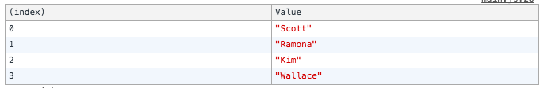
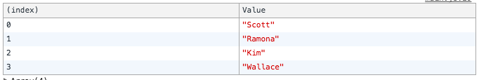
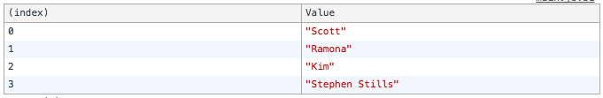
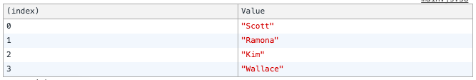
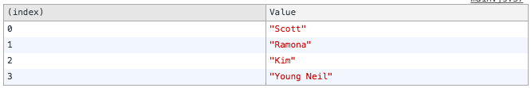

<div class="blog-header-image">
  
</div>

Confession: I still get mixed up between deep copies, shallow copies, passing by reference, passing by copy.

I *know* what they mean...if you make a copy by reference, you'll have two different variable names pointing to the same value, whereas with the other, you're creating a whole new *thing*...but I still get confused which is which. It's like I can never remember the difference between secular and non-secular...the actual definitions don't match what I intuitively think they are, so my wires get a little crossed.

Anyway...
Pass by copy? Pass by reference?
Shallow copy? Deep copy?


This is what this demo is about.

Check it on:

[Codepen]()

[Github Pages]()

[Github Repo]()


##Data type matters: Strings, Numbers, Booleans
Let's compare strings and numbers vs arrays, for example.

Let's start with numbers...

Let's say you have this:
```js
let age = 100;
let age2 = age;
```
Then you console log both:
```js
console.log({age}, {age2}); //{age: 100} {age2: 100}
```
Great, both vars have the same value. But what if you change the value of the first var, `age`?
```js
age = 200;
```
If we were to console log both, would they have the same value still?
```js
console.log({age}, {age2}); //{age: 200} {age2: 100}
```
Nope.
To be honest, this one surprised me. I was expecting that `age2` would be pointing to the same value as `age`, but I guess Numbers in JavaScript don't work that way.


Ok, how about Strings?
```js
let name = 'Peter';
let name2 = name;
console.log({name}, {name2}); //{name: "Peter"} {name2: "Peter"}
```
But let's put a new value in for `name`:
```js
name = 'Spidey';
```
Now when we check:
```js
console.log({name}, {name2}); //{name: "Spidey"} {name2: "Peter"}
```
So, Strings work like numbers this way.


Hm, Booleans?
```js
let answer1 = true;
let answer2 = answer1;
console.log({answer1}, {answer2}); //{answer1: true} {answer2: true}
answer1 = false;
console.log({answer1}, {answer2}); //{answer1: false} {answer2: true}
```
Same deal—if you assign var2 to var1, and change the value of var1, it doesn't change the value of var2.


##Data type matters: Arrays
Alright, let's look at Arrays. Setting this up:
```js
let array1 = ['Scott', 'Ramona', 'Kim', 'Wallace'];
let array2 = array1;
```
If we console table the first array:
```js
console.table(array1);
```



and console table the second array:
```js
console.table(array2);
```



So far, so good, everything is as expected: we assigned `array2` to be `array1`, and both arrays match.

BUT, what if we change one of the values in the second array?
```js
array2[3] = 'Stephen Stills';
```
Check this out. Here's console.table for `array1`:
```js
console.table(array1);
```



Though the value for index 3 in `array2` was changed, the same change was made to `array1`. Not the same behavior as Numbers, Strings, and Booleans. By the way, we could have changed the value of one of the items in `array1`, and the same changes would be reflected in `array2`. That's because both vars are pointing to the same object...it's pass by reference. We're not making a copy of an Array object when we create `array2`, just a new pointer.


Ok, so how do we make a copy of an array? There are a couple of different ways.

One would be to use `Array.slice()`. According to [the docs](https://developer.mozilla.org/en-US/docs/Web/JavaScript/Reference/Global_Objects/Array/slice), `Array.slice()` will "return a shallow copy of a portion of an array into a new array object." So...shallow copy. There are a couple of parameters you can pass into `.slice()`: the first argument will be the beginning point in the array, and the second argument will be the ending index. If we don't pass any arguments into `Array.slice()`, a copy of the entire array will be made.

Let's see it in action. Ok, we have our original array:
```js
let array1 = ['Scott', 'Ramona', 'Kim', 'Wallace'];
```


Let's say we make a copy of that array using `Array.slice()`:
```js
let array1_copy = array1.slice();
```

If we console table `array1_copy`, we'll see it's the same value:



But now, let's change the value of one of the items in either array...we'll change something in `array1`:
```js
array1[3] = 'Young Neil';
```

Let's take a look at both:
```js
console.table(array1);
```



```js
console.table(array1_copy);
```


Another way to make a copy would be to use the [ES6 spread operator](https://developer.mozilla.org/en-US/docs/Web/JavaScript/Reference/Operators/Spread_operator):
```js
let array1_spread_copy = [...array1];
```
What the spread operator will do is take every element of your iterable (examples of iterables would be arrays or strings) and place it into a container (like our new array variable).


And yet another way to make a copy would be like this:
```js
let array1_from_copy = Array.from(array1);
```
Here, we're using `Array.from`, which ["creates a new Array instance from an array-like or iterable object."](https://developer.mozilla.org/en-US/docs/Web/JavaScript/Reference/Global_Objects/Array/from)


##Data type matters: Objects
Objects are like Arrays:
```js
const character = {
  name: 'Scott Pilgrim',
  age: 24
};
const character2 = character;
```
Ok, we have a `character` object. We create a new `character2` variable and assign `character` as the value. What do we have when we console table this?
```js
console.table({character}); //name: 'Scott Pilgrim', age: 24
console.table({character2}); //name: 'Scott Pilgrim', age: 24
```

Now if we change one of the values in the `character2`, what will happen?
```js
character2.name = 'Ramona Flowers';
console.table({character}); //name: 'Ramona Flowers', age: 24
console.table({character2}); //name: 'Ramona Flowers', age: 24
```


So how would we make a copy of the object, much like `Array.slice()`, the spread operator, or `Array.from()` gives you a copy of an array?

One way is to use [`Object.assign()`](https://developer.mozilla.org/en-US/docs/Web/JavaScript/Reference/Global_Objects/Object/assign). According to the docs, this method will "copy the values of all enumerable own properties from one or more source objects to a target object. It will return the target object."

To use it, we'll need to pass an empty object as the first argument, then the object we want to copy as the second arg:
```js
const character3 = Object.assign({}, character);
console.table({character3}); //name: 'Scott Pilgrim', age24
```


Now, if we change a value in this new object, what will we get?
```js
character3.name = 'Gideon Graves';
character3.age = 31;
console.table({character}); //name: 'Scott Pilgrim', age: 24
console.table({character3}); //name: 'Gideon Graves', age: 31
```


You can also pass into `Object.assign()` a third argument, which is an object containing just a subset of the properties you want to override:
```js
const character4 = Object.assign({}, character, { name: 'Stephen Stills' });
console.table({character}); //name: 'Scott Pilgrim', age: 24
console.table({character4}); //name: 'Stephen Stills', age24
```


And there's also an [object spread operator](https://developer.mozilla.org/en-US/docs/Web/JavaScript/Reference/Operators/Spread_operator), which is very much like the array spread operator:
```js
const character5 = {...character};
character5.name = 'Young Neil';
console.table(character); //name: 'Scott Pilgrim', age: 24
console.table(character5); //name: 'Young Neil', age: 24
```

But there's a caveat—this will only make a copy one level deep. If you had an object as one of the properties, and changed one of *those* values, you'd be making changes across all objects. That might not make sense, here's an example...
Let's say we have a person object:
```js
const person = {
  name: 'Scott',
  age: 24,
  hobbies: {
    bass: 'yes',
    fighting: 'yes'
  }
};
```
Then we make a copy of that using `Object.assign()`:
```js
const person2 = Object.assign({}, person);
```
We change one of the "shallow" properties of that copied object:
```js
person2.name = 'Wallace';
```
and check to make sure this hasn't changed the value on the original object:
```js
console.log(person.name); //Scott
console.log(person2.name); //Wallace
```
Everything as expected. But now we want to change a property on a *deeper* property, one that has properties of its own:
```js
person2.hobbies.bass = 'no';
```
Look what happened!
```js
console.log(person.hobbies.bass); //no
console.log(person2.hobbies.bass); //no
```
Tricky.


##Ok, I forgot already, what's a deep copy and what's a shallow copy?
A shallow copy is pass by reference—you're just creating a pointer to point to the values stored in memory. Changes to the copy will also change the original.

A deep copy is pass by copy: you're creating a clone of the value stored in memory, and changes made to the copy will not change the original.


##Resources
<div class="resources">
  <ul>
    <li><a href="https://developer.mozilla.org/en-US/docs/Web/JavaScript/Reference/Global_Objects/Array/slice">MDN: Array.slice</a></li>
    <li><a href="https://developer.mozilla.org/en-US/docs/Web/JavaScript/Reference/Global_Objects/Array/from">MDN: Array.from</a></li>
    <li><a href="https://developer.mozilla.org/en-US/docs/Web/JavaScript/Reference/Global_Objects/Object/assign">MDN: Object.assign</a></li>
    <li><a href="https://developer.mozilla.org/en-US/docs/Web/JavaScript/Reference/Operators/Spread_operator">MDN: Object Spread Operator</a></li>
  </ul>
</div>